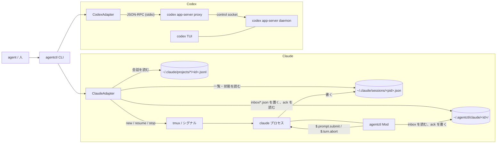

# agentctl 実装計画書 (MVP)

作成日: 2026-09-27 / 更新: 2026-09-27 (Claude の一覧を Claude Code 本体の `~/.claude/sessions/<pid>.json` から読む形に変え、Mod を受信箱専用にした。引数の誤りでヘルプを出し、コマンドごとのヘルプを持たせた (3.2)。CLI を agent が使いやすい形 ([agent-cli-patterns](https://github.com/openai/skills/blob/main/skills/.curated/cli-creator/references/agent-cli-patterns.md)) に作り直した) / 状態: 計画 (未着手)。7 章の未確認点を段階 0 で確かめてから段階 1 に入ります

## 要点

- 稼働中の Claude Code と Codex のセッションを、1 つの CLI `agentctl` から一覧、確認、起動、送信、待機、停止、アーカイブ、削除できるようにします。
- 主な利用者は人ではなく agent (Claude Code や Codex 自身) です。コマンドは「名詞 + 動詞」(`agentctl sessions list`) にそろえ、全コマンドで `--json` を出し、`doctor` と `resolve` と `raw` を持たせ、使い方を教える短いスキルを添えます (3 章)。
- Claude の一覧と状態は、Claude Code 本体が稼働中のセッションごとに書く `~/.claude/sessions/<pid>.json` から読みます。Mod (`plugins/agentctl`) の仕事は、CLI が置いた受信箱のメッセージを `$.prompt.submit` で投入することと、実行中の turn を `$.turn.abort` で止めることだけです。Channels は使いません。起動、resume、終了は CLI が tmux とシグナルで受け持ちます。
- Codex は、Codex の共有 app-server daemon に `codex app-server proxy` 経由でつなぎ、JSON-RPC (`thread/*`, `turn/*`) を呼びます。Codex の TUI も既定でこの daemon を使うので、人が起動した TUI のセッションも操作できます。
- 両者の差は `Adapter` という 1 つの interface で吸収します。
- CLI は依存ゼロの TypeScript を Node 22 の型除去で直接動かします (ビルド無し)。常駐の agentctl daemon は作りません。

## 用語

| 語 | 意味 |
|---|---|
| provider | `claude` か `codex`。セッションを動かしている側です |
| セッション | Claude では session (`sessionId`)、Codex では thread (`threadId`) です。agentctl では両方を「セッション」と呼び、ID は元の ID をそのまま使います |
| adapter | provider ごとの差を吸収する実装です。`src/adapters/claude.ts` と `src/adapters/codex.ts` の 2 つです |
| セッション記録 | Claude Code 本体が稼働中のセッションごとに書く `~/.claude/sessions/<pid>.json` です。公開された形式ではありません |
| 共有ディレクトリ | `${AGENTCTL_HOME:-~/.agentctl}`。Claude の Mod と CLI がファイルでやり取りする場所と、agentctl が起動したセッションの記録を置きます |
| 受信箱 (inbox) | CLI が Claude のセッションに届けたいメッセージを 1 件 1 ファイルで置くディレクトリです |
| ack | Mod が受信箱のメッセージを処理した結果を書くファイルです。CLI はこれを見て送信の成否を知ります |
| daemon (Codex) | `codex app-server daemon start` で動く共有の app-server です。control socket で待ち受けます |
| 付属スキル | agent に agentctl の使い方を教える短い SKILL.md です (3.9) |

## 1. 既存 API と Mod で実現できる範囲 (調査結果)

### 1.1 Claude Code (2.1.283)

このリポジトリの doc-desk Mod の実装と検証 (docs/doc-desk/plan.md 4 章)、バイナリに入っている engine の API 一覧、実機の `~/.claude/sessions/` を確かめました。

| やりたいこと | 使うもの | 判定 |
|---|---|---|
| 稼働中のセッションを列挙する | Mod の API には無い (`$.session.*` は自分のセッションのことしか返さず、他のセッションを列挙する API は無い)。代わりに本体のセッション記録 `~/.claude/sessions/<pid>.json` を読む | 可。記録には `pid`, `sessionId`, `cwd`, `name`, `kind`, `status` (`busy` / `idle` など), `waitingFor`, `startedAt`, `updatedAt`, `statusUpdatedAt`, `procStart`, `version` がある。値の種類は未確認 → C1 |
| 保存済み (止まっている) セッションを列挙する | transcript `~/.claude/projects/<cwd を変換した名前>/<sessionId>.jsonl` | 可 |
| プロセスが生きているか、PID が使い回されていないか | セッション記録の `pid` と `procStart` を `/proc/<pid>/stat` と照合する | 可の見込み → C1 |
| CLI からのメッセージを受ける | Mod の `$.clock.every` + `$.fs.list` + `$.fs.read` | 可の見込み。共有ディレクトリ (cwd の外) を読めるかは未確認 → C2 |
| Claude に投入する | Mod の `$.prompt.submit({ text })` | 可 (doc-desk の V5, V7)。`{ drop }` で断られることがある。busy 中の振る舞いは未確認 → C3 |
| 実行中の turn を止める | Mod の `$.turn.abort({ turnId })` (`turn.start` の `turnId`) | 可 (live-view で設計済み) |
| プロセスを終わらせる | Mod からは不可 (終了 API が無い) | CLI がセッション記録の `pid` にシグナルを送るか、tmux のセッションを閉じる |
| 新規起動 / resume | `claude --session-id <uuid>` / `claude --resume <id>` | 可 (CLI のフラグを確認済み)。TTY が要るので tmux の中で起動する |
| 会話の中身を読む | transcript の jsonl | 可 |
| アーカイブ / 削除 | Claude Code に API は無い | agentctl 側で模す (アーカイブは印を付けて一覧から隠す、削除は transcript の jsonl を消す) |

使わないもの:

- セッション記録の `messagingSocketPath` は、セッション同士のメッセージのやり取り (`SendMessage`) の socket です。Channels を使わない方針から外れるので使いません。
- Mod の `session.send` / `session.receive` / `session.attach` は bridge (Channels / Remote Control) 経由の配送なので使いません。
- Mod の `$.process.spawn` で常駐の子を持ち、push 型で受ける案は、寿命の扱いが未確認なので MVP では採りません (9 章)。

### 1.2 Codex (openai/codex main、2026-09-27 時点)

`codex-rs/app-server-protocol` と `codex-rs/cli` のソースで確かめました。

| やりたいこと | 使うもの | 判定 |
|---|---|---|
| 共有サーバにつなぐ | `codex app-server daemon start` (起動済みなら何もしない) と `codex app-server proxy` (stdio を control socket へ中継) | 可。agentctl は socket の場所を知らなくてよい |
| 人が起動した TUI を操作する | TUI は既定で共有 daemon を使う (`--no-daemon` で外れる) | 可の見込み → C5 |
| 一覧 | `thread/loaded/list` (daemon に読み込み済み) と `thread/list` (保存済み。`cursor`, `limit`, `archived`, `cwd` で絞れる) | 可 |
| 詳細と会話の中身 | `thread/read`、`thread/turns/list`、`thread/items/list` | 可 |
| 状態 | `Thread.status`: `notLoaded` / `idle` / `active { activeFlags: [waitingOnApproval, waitingOnUserInput] }` / `systemError`。変化は `thread/status/changed` 通知 | 可 |
| 新規 | `thread/start { cwd }` → 必要なら `turn/start` | 可 |
| resume | `thread/resume` | 可 |
| 送信 | idle なら `turn/start`、active なら `turn/steer { threadId, input, expectedTurnId }` | 可。`expectedTurnId` が必須なので、実行中の turn の ID を先に取る → C6 |
| 停止 | `turn/interrupt { threadId, turnId }`、`thread/unsubscribe` | 可。unsubscribe で daemon から降ろせるかは未確認 → C7 |
| アーカイブ / 削除 | `thread/archive` / `thread/delete` (`thread/unarchive` もある) | 可。live な内部 worker は `-32600` で拒まれる |

## 2. アーキテクチャ



- CLI は 1 コマンドごとに起動して終わる短命のプロセスです。常駐するのは Claude のプロセスと Codex の daemon だけで、どちらも既存のものです。
- Claude の一覧は本体のセッション記録から作るので、Mod を入れていないセッションも `sessions list` に出ます。`send` と `stop --turn` だけは Mod が要ります。Mod が載っているかは、Mod が起動時に書く `mod.json` で判断し、`capabilities.send` として出します。
- `sessions create` / `sessions resume` で起動したセッションは tmux の中で動くので、`tmux attach -t agentctl-<id8>` で人が画面を見られます (権限の確認や信頼ダイアログに答えるときに使う)。

### 2.1 Claude: 共有ディレクトリのファイル形式

```
~/.agentctl/
  claude/<sessionId>/
    mod.json            Mod だけが書く (起動時に 1 回)
    launch.json         CLI だけが書く (agentctl が起動したとき、アーカイブしたとき)
    inbox/<msgId>.json  CLI が書く (一時名で書いて rename)
    acks/<msgId>.json   Mod が書く
```

書き手をファイルごとに 1 人に決め、ロックを持ちません。

- `mod.json`: `{ v: 1, sessionId, pid, modVersion, startedAt }`。`/clear` で `sessionId` が変わったら、新しい ID のディレクトリにも書きます。
- `launch.json`: `{ v: 1, tmux: "agentctl-<id8>", name, dir, launchedAt, archived: false }`。
- `inbox/<msgId>.json`: `{ v: 1, id, kind: "prompt"|"interrupt", text?, createdAt }`。`msgId` は時刻順に並ぶ ID (`<epochms>-<rand>`) です。
- `acks/<msgId>.json`: `{ v: 1, id, status: "submitted"|"dropped"|"aborted"|"error", detail?, at }`。

Mod の受信箱の処理:

1. `$.clock.every(500ms)` で `inbox/` を `$.fs.list` し、`.json` だけを名前順に見ます。
2. `acks/<msgId>.json` が既にある、またはメモリ上で処理済みのものは飛ばします (Mod はファイルを消せないため)。
3. `prompt` は `$.prompt.submit({ text })`、`interrupt` は `$.turn.abort({ turnId })` (`turn.start` で覚えた main の turn) を呼び、結果を ack に書きます。
4. 処理済みの `inbox` と `acks` のファイルは CLI が消します (ack を読んだ直後と、`sessions list` のついで)。

heartbeat は持ちません。生存はセッション記録の `pid` と `procStart` で判断します。

### 2.2 共通の型と Adapter

```ts
type Provider = 'claude' | 'codex'
type State = 'running' | 'waiting' | 'idle' | 'stopped' | 'archived' | 'error'

type Session = {
  id: string; provider: Provider; state: State
  cwd: string; title: string | null
  createdAt: string; updatedAt: string          // ISO 8601
  capabilities: { send: boolean; interrupt: boolean; stop: boolean }
  waitingFor: string | null                    // 権限の確認待ちなど
  process: { pid: number | null; tmux: string | null }
}

type Message = { id: string; role: 'user' | 'assistant' | 'tool'; text: string; at: string }

interface Adapter {
  provider: Provider
  list(q: { all: boolean; cwd?: string; limit: number; cursor?: string }): Promise<{ items: Session[]; nextCursor: string | null }>
  get(id: string): Promise<Session & { raw: unknown }>
  messages(id: string, q: { last: number }): Promise<Message[]>
  create(dir: string, o: { prompt?: string; name?: string; args: string[] }): Promise<Session>
  resume(id: string): Promise<Session>
  send(id: string, text: string): Promise<{ delivery: 'turn_started' | 'steered' | 'submitted' | 'queued' }>
  stop(id: string, o: { turnOnly: boolean }): Promise<void>
  archive(id: string): Promise<void>
  delete(id: string): Promise<void>
  raw(method: string, params: unknown): Promise<unknown>
}
```

`wait` は adapter に持たせず、CLI 本体が `get` を 1 秒ごとに呼んで状態を見ます (provider ごとの実装が要らない)。

状態の対応:

| agentctl | Claude (セッション記録) | Codex (`Thread.status`) |
|---|---|---|
| `running` | `status: busy` | `active` (フラグ無し) |
| `waiting` | `waitingFor` がある (値の種類は C1) | `active` + `waitingOnApproval` / `waitingOnUserInput` |
| `idle` | `status: idle` | `idle` |
| `stopped` | 記録が無い、または `pid` が死んでいる / 別のプロセスになっている。transcript だけある | `notLoaded` |
| `archived` | `launch.json` の `archived: true` | `thread/list { archived: true }` に出るもの |
| `error` | — | `systemError` |

## 3. CLI 仕様 (agent 向け)

[agent-cli-patterns](https://github.com/openai/skills/blob/main/skills/.curated/cli-creator/references/agent-cli-patterns.md) に従い、次の方針で作ります。

- 名詞 + 動詞にそろえます。名詞は `sessions` だけで、`doctor` と `raw` を加えます。
- 発見 (`list`) → 解決 (`resolve`) → 読む (`get`) → 文脈 (`messages`) の順に、小さな読み取りのコマンドを揃えます。安定した ID が手元にあれば、agent が検索し直さなくてよいようにします。
- `--json` を全コマンドに付けます。stdout には JSON だけを出し、進捗と診断は stderr に出します。
- 書き込み (`send`, `stop`, `archive`, `delete`, `raw` の書き込み系) は、実際に効く操作として扱い、`--help` にもそう書きます。
- 対話の確認はしません。TTY が無い agent が止まってしまうからです。消す操作は `--yes` が無ければエラーで返します。

### 3.1 コマンド一覧 (`agentctl --help` にそのまま載せる)

```
Discover
  agentctl doctor                                   使える provider と足りないもの
  agentctl sessions list [--provider P] [--cwd DIR] [--state S] [--all] [--limit N] [--cursor C]

Resolve
  agentctl sessions resolve <id-prefix | name | directory>

Read
  agentctl sessions get <id>
  agentctl sessions messages <id> [--last N]        直近の会話 (既定 10 件)

Wait
  agentctl sessions wait <id> [--until idle|stopped|waiting] [--timeout SEC]

Write (実際に効きます)
  agentctl sessions create <provider> <directory> [--prompt TEXT | --prompt-file F] [--name NAME] [-- <provider の引数>]
  agentctl sessions resume <id>
  agentctl sessions send <id> (--text TEXT | --text-file F | --text-file -)
  agentctl sessions stop <id> [--turn]
  agentctl sessions archive <id>
  agentctl sessions delete <id> --yes

Raw (修理用。書き込み系も実際に効きます)
  agentctl raw codex <json-rpc-method> [--params-json JSON]
  agentctl raw claude record <id>                   セッション記録と mod.json をそのまま出す

Global
  --json       stdout に JSON だけを出す
  --provider   claude | codex (ID の解決を片方に限る)
```

人向けに、最初の構想の短い名前を別名として残します: `ps` = `sessions list`, `info` = `sessions get`, `new` = `sessions create`, `send` / `stop` / `archive` / `delete` = `sessions <同名>`。`--help` では正式な形だけを見せ、別名は末尾に 1 行で書きます。

### 3.2 ヘルプと引数の誤り

ヘルプは各階層で出せるようにし、引数を間違えたときは、そのコマンドのヘルプを添えて返します。agent は `--help` を読んで打ち直すので、エラーの 1 行だけでは次の手が分かりません。

出し方 (どれも同じ文を stdout に出し、終了コード 0):

```
agentctl --help                    全体: 名詞の一覧、Global フラグ、最初に打つコマンド
agentctl sessions --help           sessions の動詞の一覧と、それぞれの 1 行説明
agentctl sessions send --help      send の書式、引数、フラグ、例、JSON の形、終了コード
agentctl help sessions send        上と同じ (-h も同じ)
agentctl                           引数無しは agentctl --help と同じ
agentctl sessions                  動詞無しは agentctl sessions --help と同じ
```

各コマンドのヘルプに載せるもの:

```
Usage: agentctl sessions send <id> (--text TEXT | --text-file F | --text-file -) [--json]

Send a message to a session. Starts a turn if idle; steers the running turn (codex)
or submits it to the prompt (claude) if busy.
This is a live write.

Arguments:
  <id>                session id or unique id prefix (see: agentctl sessions resolve)

Flags:
  --text TEXT         message body
  --text-file F       read the body from F ("-" for stdin)
  --json              print JSON only on stdout

Examples:
  agentctl --json sessions send 0199a1c2 --text "run the tests again"
  echo "..." | agentctl --json sessions send 0199a1c2 --text-file -

Output (--json):
  { "session": Session, "delivery": "turn_started"|"steered"|"submitted"|"queued", "next": [string] }

Exit codes: 0 ok, 2 bad arguments, 3 not found/ambiguous, 4 unsupported (no Mod), 1 other
```

引数を間違えたとき (終了コード 2):

| 誤り | 出すもの |
|---|---|
| 知らない名詞・動詞 (`agentctl sesions list`, `agentctl sessions lsit`) | エラー 1 行、近い候補 (`did you mean: sessions list?`、編集距離 2 以内)、1 つ上の階層のヘルプ (動詞の一覧) |
| 知らないフラグ、値の無いフラグ、必須の引数が無い、同時に使えないフラグ | エラー 1 行と、そのコマンドのヘルプ全文 |
| 値の形が違う (`--limit abc`, `--until done`) | エラー 1 行 (取れる値を並べる) と、そのコマンドのヘルプ全文 |
| `delete` に `--yes` が無い | `confirmation_required` と、そのコマンドのヘルプ全文 |

- `--json` が無いときは、エラーとヘルプを stderr に出します (stdout は空)。
- `--json` のときは、stdout を JSON だけに保つため、ヘルプを `error` の中に入れます。stderr にも同じヘルプを出します。

```json
{ "error": { "code": "invalid_argument", "message": "unknown flag: --txt",
             "suggestions": ["--text"],
             "usage": "Usage: agentctl sessions send <id> (--text TEXT | ...)\n...",
             "help": "agentctl sessions send --help" } }
```

- `agentctl --json help sessions send` は、ヘルプを JSON (`{ command, usage, description, args, flags, examples, output, exitCodes, isWrite }`) で返します。agent が書式を機械的に確かめたいとき用です。
- 実行時の失敗 (`not_found`, `provider_error` など) ではヘルプを出しません。引数は正しいので、ヘルプを出すと本当の原因が埋もれるからです。代わりに `hint` で次のコマンドを示します。

作り方: コマンドの定義 (名前、説明、引数、フラグ、例、出力の形、書き込みかどうか) を `src/commands.ts` に 1 つの表として持ち、引数解析、検査、ヘルプの文、`help --json` をすべてこの表から作ります。ヘルプと実際の挙動がずれないようにするためです。

### 3.3 ID と解決

- 各コマンドの `<id>` は、完全な ID か、ID の前方一致 (docker と同じ) です。両 provider の ID をまとめて照合し、1 件に決まらなければ `ambiguous` エラーで候補を返します。
- `sessions resolve` は、ID の前方一致、`--name` で付けた名前、ディレクトリ (その cwd で動いているセッション) を受け取り、候補を返します。人の言葉 (「api のほうの Codex」) を ID に変える入口です。
- 出力の `id` は常に完全な ID です。agent は以後それを使います。

### 3.4 各コマンドの provider ごとの中身

| コマンド | Claude | Codex |
|---|---|---|
| `doctor` | `claude --version`、`tmux -V`、`~/.claude/sessions/` が読めるか、Mod が有効か (稼働中のセッションの `mod.json` の有無) | `codex --version`、daemon につながるか (`initialize` が返るか) |
| `sessions list` | セッション記録 (稼働中)。`--all` で transcript と `launch.json` から止まっているものも | `thread/loaded/list`。`--all` で `thread/list` (`cursor` をそのまま `nextCursor` に) |
| `sessions get` | セッション記録、`mod.json`、`launch.json`、transcript のパス | `thread/read` |
| `sessions messages` | transcript の jsonl の末尾から user / assistant の行を N 件 | `thread/turns/list` か `thread/items/list` の末尾 N 件 |
| `sessions wait` | `get` の繰り返し | `get` の繰り返し |
| `sessions create` | UUID を作り、`tmux new-session -d -s agentctl-<id8> -c <dir> claude --session-id <uuid> [--name] [args] [prompt]`。セッション記録が現れるまで最大 30 秒待つ | `daemon start` → `thread/start { cwd }` → `--prompt` があれば `turn/start` |
| `sessions resume` | tmux で `claude --resume <id>` | `thread/resume` |
| `sessions send` | `inbox/` に置き、`acks/` を最大 10 秒待つ | idle なら `turn/start`、active なら `turn/steer` |
| `sessions stop` | busy なら `interrupt` を送る → tmux のセッションを閉じる。無ければ `pid` に SIGTERM (`procStart` が合うときだけ) | `turn/interrupt` → `thread/unsubscribe` |
| `sessions stop --turn` | `interrupt` を送るだけ | `turn/interrupt` だけ |
| `sessions archive` | 止めてから `launch.json` に `archived: true` | `thread/archive` |
| `sessions delete` | 止めてから共有ディレクトリと transcript の jsonl を消す | `thread/delete` |

`send` の意味の揃え方: Codex は active 中の送信を `turn/steer` にします。Claude は `$.prompt.submit` に任せ、実際にどうなったかを `delivery` (`submitted` / `queued`) で返します。busy 中の振る舞いは C3 で確かめます。

### 3.5 JSON の形

成功 (stdout、終了コード 0。結果が空でも 0):

```jsonc
// sessions list
{ "items": [ { "id": "3f746262-1811-5237-9497-992c2b8dd58a", "provider": "claude", "state": "running",
               "cwd": "/home/u/src/agent-kit", "title": "agent-kit-1f",
               "createdAt": "...", "updatedAt": "...", "waitingFor": null,
               "capabilities": { "send": true, "interrupt": true, "stop": true },
               "process": { "pid": 103, "tmux": null } } ],
  "nextCursor": null }

// sessions create / send / stop など、書き込みの結果には次に打つコマンドを添える
{ "session": { ... }, "delivery": "turn_started",
  "next": ["agentctl --json sessions wait 0199a1c2-... --until idle",
           "agentctl --json sessions messages 0199a1c2-... --last 1"] }
```

失敗 (stdout、終了コード 0 以外):

```json
{ "error": { "code": "ambiguous_id", "message": "3f7 matches 2 sessions",
             "candidates": [ { "id": "...", "provider": "claude" }, { "id": "...", "provider": "codex" } ],
             "hint": "use a longer prefix or --provider" } }
```

`error.code` の一覧: `invalid_argument` (3.2 のとおり `usage` と `suggestions` を付ける), `not_found`, `ambiguous_id`, `confirmation_required`, `unsupported` (例: Mod の無いセッションへの `send`), `provider_unavailable` (tmux / codex / daemon が無い), `timeout` (`wait` と `send` の ack), `provider_error` (Codex の JSON-RPC エラーをそのまま `detail` に)。

`--json` が無いときは人向けの表と文を stdout に出し、エラーは stderr に 1 行で出します。

JSON には、transcript の本文や token などの余計な中身は入れません。`messages` の本文は各 2,000 文字で切り、切ったことを `truncated: true` で示します。

### 3.6 終了コード

| コード | 意味 |
|---|---|
| 0 | 成功 (一覧が空でも 0) |
| 1 | 実行時の失敗 (`provider_error`, `timeout`) |
| 2 | 引数の誤り (`invalid_argument`, `confirmation_required`) |
| 3 | セッションが見つからない / 曖昧 (`not_found`, `ambiguous_id`) |
| 4 | provider が使えない / その操作に対応していない (`provider_unavailable`, `unsupported`) |

`doctor --json` は、何も入っていない環境でも終了コード 0 で、足りないものを項目ごとに返します。

### 3.7 広さの調整

- `sessions list` は既定で稼働中だけ、最大 20 件です。`--all` で止まっているものとアーカイブも含めます。
- `--limit` と `--cursor` を持ち、`nextCursor` を返します。Codex は `thread/list` の cursor を、Claude は transcript の更新時刻順の位置を cursor にします。
- `sessions messages` は既定で直近 10 件です。

### 3.8 raw

- `raw codex <method>` は、agentctl がつないだ daemon に JSON-RPC をそのまま投げ、結果をそのまま返します。`thread/delete` などの書き込みも通るので、`--help` に「実際に効きます」と書きます。
- `raw claude record <id>` は、セッション記録と `mod.json` と `launch.json` をまとめて返します。読み取りだけです。

### 3.9 付属スキル

`plugins/agentctl/skills/agentctl/SKILL.md` に置きます。README より短く、道順だけを書きます。Codex でも使えるよう、Claude 固有の記法は使いません (`~/.codex/skills/` に写せば使える)。

```md
Start with:

agentctl --json doctor
agentctl --json sessions list

To hand work to another agent:

agentctl --json sessions create codex <dir> --prompt-file task.md
agentctl --json sessions wait <id> --until idle --timeout 1800
agentctl --json sessions messages <id> --last 1

To steer a running session:

agentctl --json sessions resolve <dir or name>
agentctl --json sessions send <id> --text-file -

Rules:

- Use --json when reading output. Use the full id from the output.
- Do not stop, archive or delete sessions the user did not ask about.
- delete needs --yes; ask the user first.
- Use raw only when a sessions command is missing.
```

## 4. ディレクトリ構成

```
plugins/agentctl/                 Claude Mod (受信箱) と付属スキル
  .claude-plugin/plugin.json
  hooks/hooks.json
  hooks/register.ts               session.start (mod.json)、turn.start (turnId)、受信箱の監視
  hooks/protocol.ts               共有ディレクトリのファイル形式と定数 (CLI も import する)
  hooks/inbox.ts                  受信箱の処理 (純関数。テストしやすくする)
  skills/agentctl/SKILL.md        付属スキル (3.9)
  tests/register.test.ts          claude plugin test
  README.md
tools/agentctl/                   CLI
  package.json                    "type": "module"、"bin"、依存なし
  bin/agentctl                    #!/usr/bin/env node → src/main.ts を読むだけ
  src/main.ts                     引数解析、コマンドの振り分け
  src/commands.ts                 コマンドの定義の表 (引数解析、検査、ヘルプの元。3.2)
  src/help.ts                     表からヘルプの文と help --json を作る、近い候補の計算
  src/output.ts                   JSON / 表の出し分け、エラーの形、終了コード
  src/session.ts                  共通の型、Adapter interface、ID の解決
  src/wait.ts                     sessions wait
  src/adapters/claude.ts
  src/adapters/codex.ts
  src/claude/records.ts           ~/.claude/sessions と transcript の読み取り、生存判定
  src/claude/inbox.ts             共有ディレクトリの読み書き (atomic write、掃除)
  src/claude/tmux.ts              tmux の起動と終了
  src/codex/rpc.ts                `codex app-server proxy` 越しの JSON-RPC クライアント
  test/*.test.ts                  node --test
docs/agentctl/plan.md             この文書
docs/agentctl/usage.md            利用者ガイド (段階 6)
```

- CLI は Node 22.18 以降の型除去 (`node src/main.ts`) で動かします。enum と namespace を使わない、import に `.ts` を付ける、の 2 点を守ります。
- `protocol.ts` は Mod 側に置き、CLI は `../../../plugins/agentctl/hooks/protocol.ts` を相対 import します。Mod から plugin の外を import できるかが不確かなので、向きを CLI → Mod にします。

## 5. 実装手順

各段階を 1 PR にします。段階ごとに動くものが増えるように並べました。

### 段階 0: 未確認点の確認 (スパイク)

7 章の C1〜C7 を、最小の Mod と手打ちの JSON-RPC で確かめます。結果で設計が変わるものがあれば、この文書を直してから段階 1 に入ります。

### 段階 1: CLI の骨組み

- `commands.ts` の定義の表、`main.ts` の引数解析 (`node:util` の `parseArgs` を表から組む)、`help.ts` (各階層のヘルプ、近い候補、`help --json`)、`output.ts` (JSON とエラーの形、終了コード)、`session.ts` (型と ID の解決)、`wait.ts`。
- 偽の adapter で `sessions list` / `get` / `resolve` / `wait`、エラーの形と終了コードをテストします。
- ヘルプは、全コマンドで `--help` / `-h` / `help <...>` が同じ文を返すこと、引数の誤りの 4 種類 (3.2 の表) でヘルプが付いて終了コード 2 になること、`--json` のとき stdout が JSON だけで `error.usage` が入ることをテストします。

### 段階 2: Claude の読み取り

- `records.ts`: セッション記録の読み取りと生存判定、transcript の列挙と末尾の読み取り。
- `doctor`、`sessions list` / `get` / `messages` / `resolve`、`raw claude record` を Claude につなぎます。Mod はまだ要りません。

### 段階 3: Claude Mod と送信

- Mod: `session.start` で `mod.json`、`turn.start` で `turnId`、受信箱の監視と ack。
- CLI: `sessions send` (inbox に置く → ack を待つ → 両方消す) と `sessions stop --turn`。
- 付属スキルもここで置きます。

### 段階 4: Claude の lifecycle

- `tmux.ts` と `sessions create` / `resume` / `stop` / `archive` / `delete`。
- `create` はセッション記録が 30 秒で現れなければ `provider_unavailable` で返し、`hint` に「起動時のダイアログで止まっている可能性があります。`tmux attach -t agentctl-<id8>` で確かめてください」と書きます。

### 段階 5: Codex adapter

- `rpc.ts`: `codex app-server proxy` を子として起動し、`initialize` → `initialized` → 要求 → 終了。行区切りの JSON で、ID の対応と通知の読み捨てだけを持つ小さなクライアントにします。つながらなければ `codex app-server daemon start` を 1 回呼んで再試行します。
- `doctor` から `raw codex` まで、全コマンドを 1 つずつ。
- テストは、JSON-RPC を返す偽の proxy (小さな node スクリプト) を `AGENTCTL_CODEX_PROXY` で差し替えて行います。

### 段階 6: 仕上げ

- `docs/agentctl/usage.md` (Mod の入れ方、tmux の要件、困ったとき)。
- 実機での通し確認: 両 provider で `doctor` → `create` → `list` → `send` → `wait` → `messages` → `stop` → `resume` → `archive` → `delete`。
- agent に使わせる確認: 付属スキルだけを持たせた Claude と Codex に「別の agent に作業を頼み、終わったら結果を要約して」と頼み、`--help` と付属スキルだけで迷わず通るかを見ます。詰まったところは help か付属スキルを直します。

### テストの方針

- Mod: `claude plugin test` (doc-desk と同じ `claude-code/testing`)。受信箱の処理は純関数に切り出して単体で試します。
- CLI: `node --test`。`HOME` を一時ディレクトリにして、セッション記録と transcript と Mod が書くファイルを fixture で置きます。tmux とシグナルは薄い関数に閉じ込めて差し替えます。
- 全コマンドについて、`--json` の stdout が JSON として読めること、stderr に JSON が混ざらないことを確かめます。
- 型検査: `npx -y -p typescript tsc --noEmit` を両方に。

## 6. セッション記録を使う危うさと対策

`~/.claude/sessions/<pid>.json` は公開された形式ではないので、Claude Code の更新で形が変わるおそれがあります。

- 読むのは `records.ts` の 1 か所だけにし、必須の項目は `pid` と `sessionId` と `cwd` に絞ります。ほかの項目は無ければ `null` にします。
- 読めない記録は飛ばし、`doctor` に「読めない記録が N 件ある (Claude Code <version>)」と出します。
- `kind` が `interactive` 以外 (subagent や背景の job など) の扱いは C1 で確かめ、MVP では一覧から外します。

## 7. 未確認点 (段階 0 で確かめる)

| 番号 | 確かめること | 影響 | 確かめ方 |
|---|---|---|---|
| C1 | セッション記録の `status` と `waitingFor` と `kind` が取る値。`procStart` が `/proc/<pid>/stat` の何と対応するか。プロセスが落ちたとき記録が残るか | `state` の対応表、生存判定、一覧に出す範囲 | 対話と `-p` で起動し、権限の確認を出し、kill して記録を見る |
| C2 | Mod の `$.fs.list` / `$.fs.read` / `$.fs.write` が cwd の外 (`~/.agentctl`) に届くか | 届かなければ、共有ディレクトリを `$.process.run` の小さなスクリプト経由で読み書きする | 最小の Mod |
| C3 | 対話モード (tmux の中) で、idle と busy のそれぞれで `$.prompt.submit` がどうなるか (即時 turn / キュー / `drop`) | `send` の `delivery` の値 | 最小の Mod + 手で送信 |
| C4 | 新しいディレクトリで `claude --session-id` を tmux で起動したとき、信頼ダイアログの前にセッション記録と `session.start` が来るか | `create` の待ち方と `hint` | 手で起動 |
| C5 | 人が起動した `codex` TUI の thread が `thread/loaded/list` に出て、`turn/steer` が TUI に反映されるか | Codex の「稼働中セッションの操作」が成り立つか | 手で起動 + proxy |
| C6 | 実行中の turn の ID を `thread/read` か `thread/turns/list` のどちらで取るのが確実か | `send` (steer) と `stop` | proxy |
| C7 | `thread/unsubscribe` の後、他に購読者がいなければ thread が `notLoaded` に戻るか。TUI が購読中ならどうなるか | Codex の `stop` の意味 | proxy |

## 8. MVP でやらないこと

- 出力のストリーミング (`messages --follow`)、`attach` コマンド (tmux attach と `codex resume` を案内するだけにする)。
- `--jq` や `--json <fields>` による項目の選択 (パターン文書でも「要るときだけ」としている。`jq` で足りる)。
- 複数マシン、リモートの daemon、Windows (tmux が前提のため)。
- アーカイブの取り消し (`unarchive`)、名前の変更。

## 9. 将来の候補

- Mod の受信を `$.process.spawn` の常駐の子 (unix socket で待ち、届いたら stdout に 1 行出す) に替え、500 ms のポーリングを無くす。
- `sessions messages --follow` (Claude は transcript の追記、Codex は通知の購読)。
- `sessions wait` を Codex では `thread/status/changed` 通知で待つ (ポーリングを無くす)。
