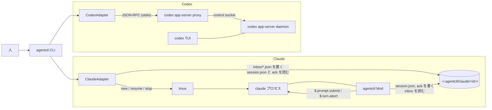

# agentctl 実装計画書 (MVP)

作成日: 2026-09-27 / 状態: 計画 (未着手)。6 章の未確認点を段階 0 で確かめてから段階 1 に入ります

## 要点

- 稼働中の Claude Code と Codex のセッションを、1 つの CLI `agentctl` から一覧、確認、起動、送信、停止、アーカイブ、削除できるようにします。
- Claude 側は Channels を使わず、Claude Mod (`plugins/agentctl`) を出先にします。Mod は共有ディレクトリ `~/.agentctl/claude/<sessionId>/` に自分の状態と heartbeat を書き、CLI が同じ場所に置いた受信箱のファイルを読んで `$.prompt.submit` で Claude に投入します。起動、resume、終了は CLI が tmux で受け持ちます。
- Codex 側は、Codex の共有 app-server daemon に `codex app-server proxy` 経由でつなぎ、JSON-RPC (`thread/*`, `turn/*`) を呼びます。Codex の TUI も既定でこの daemon を使うので、人が起動した TUI のセッションも操作できます。
- 両者の差は `Adapter` という 1 つの interface で吸収します。CLI 本体は adapter のメソッドを呼ぶだけにします。
- CLI は依存ゼロの TypeScript を Node 22 の型除去で直接動かします (ビルド無し)。常駐の agentctl daemon は作りません。

## 用語

| 語 | 意味 |
|---|---|
| provider | `claude` か `codex`。セッションを動かしている側です |
| セッション | Claude では session (`sessionId`)、Codex では thread (`threadId`) です。agentctl では両方を「セッション」と呼び、ID は元の ID をそのまま使います |
| adapter | provider ごとの差を吸収する実装です。`src/adapters/claude.ts` と `src/adapters/codex.ts` の 2 つです |
| 共有ディレクトリ | `${AGENTCTL_HOME:-~/.agentctl}`。Claude の Mod と CLI がファイルでやり取りする場所です |
| 受信箱 (inbox) | CLI が Claude のセッションに届けたいメッセージを 1 件 1 ファイルで置くディレクトリです |
| ack | Mod が受信箱のメッセージを処理した結果を書くファイルです。CLI はこれを見て送信の成否を知ります |
| daemon (Codex) | `codex app-server daemon start` で動く共有の app-server です。control socket で待ち受けます |

## 1. 既存 API と Mod で実現できる範囲 (調査結果)

### 1.1 Claude Code (2.1.283、Claude Mods)

このリポジトリの doc-desk Mod の実装と検証 (docs/doc-desk/plan.md 4 章) に加え、バイナリに入っている engine の API 一覧を確かめました。

| やりたいこと | 使うもの | 判定 |
|---|---|---|
| セッション ID を知る | `$.session.id` | 可 (doc-desk で使用中) |
| 状態 (busy / idle) を知る | `turn.start` / `turn.complete` フック (`e.agentId` が無いものが main) | 可 (doc-desk で使用中) |
| 最後の応答を info に出す | `turn.complete` の `e.answer` | 可 |
| 終了を知る | `session.end` (`reason`, `sessionId`, `resume`) | 可。`reason` が `clear` / `resume` のときはプロセスが続く (doc-desk 5 章) |
| heartbeat | `$.clock.every` + `$.fs.write` | 可 (タイマーはフック予算に数えない。V1) |
| CLI からのメッセージを受ける | `$.clock.every` + `$.fs.list` + `$.fs.read` | 可の見込み。`fs.list` は engine の API 一覧にある。共有ディレクトリ (cwd の外) を読めるかは未確認 → 6 章 C1 |
| Claude に投入する | `$.prompt.submit({ text })` | 可 (V5, V7)。`{ drop }` で断られることがある。busy 中の振る舞いは未確認 → C2 |
| 実行中の turn を止める | `$.turn.abort({ turnId })` (`turn.start` の `turnId`) | 可 (live-view で設計済み) |
| 自分の PID を知る | `$.process.run(['sh','-c','echo $PPID'])` | 未確認 → C3 |
| プロセスを終わらせる | Mod からは不可 (終了 API が無い) | CLI がシグナルか tmux で行う |
| 新規起動 / resume | `claude --session-id <uuid>` / `claude --resume <id>` | 可 (CLI のフラグを確認済み)。TTY が要るので tmux の中で起動する |
| アーカイブ / 削除 | Claude Code に API は無い | agentctl 側で模す (アーカイブは印を付けて一覧から隠す、削除は transcript の jsonl を消す) |

使わないもの: `session.send` / `session.receive` / `session.attach` は bridge (Channels / Remote Control) 経由の配送で、今回の方針 (Channels を使わない) から外します。`$.process.spawn` で常駐の子を持ち、その stdout で push 型に受ける案もありますが、寿命の扱いが未確認なので MVP はファイルのポーリングにします (8 章)。

### 1.2 Codex (openai/codex main、2026-09-27 時点)

`codex-rs/app-server-protocol` と `codex-rs/cli` のソースで確かめました。

| やりたいこと | 使うもの | 判定 |
|---|---|---|
| 共有サーバにつなぐ | `codex app-server daemon start` (起動済みなら何もしない) と `codex app-server proxy` (stdio を control socket へ中継) | 可。agentctl は socket の場所を知らなくてよい |
| 人が起動した TUI を操作する | TUI は既定で共有 daemon を使う (`--no-daemon` で外れる) | 可の見込み → C5 |
| 一覧 | `thread/loaded/list` (daemon に読み込み済み) と `thread/list` (保存済み。`cursor`, `limit`, `archived`, `cwd` で絞れる) | 可 |
| 詳細 | `thread/read`、`thread/turns/list` | 可 |
| 状態 | `Thread.status`: `notLoaded` / `idle` / `active { activeFlags: [waitingOnApproval, waitingOnUserInput] }` / `systemError`。変化は `thread/status/changed` 通知 | 可 |
| 新規 | `thread/start { cwd }` → 必要なら `turn/start` | 可 |
| resume | `thread/resume` | 可 |
| 送信 | idle なら `turn/start`、active なら `turn/steer { threadId, input, expectedTurnId }` | 可。`expectedTurnId` が必須なので、実行中の turn の ID を先に取る → C6 |
| 停止 | `turn/interrupt { threadId, turnId }`、`thread/unsubscribe` | 可。unsubscribe で daemon から降ろせるかは未確認 → C7 |
| アーカイブ / 削除 | `thread/archive` / `thread/delete` (`thread/unarchive` もある) | 可。live な内部 worker は `-32600` で拒まれる |

## 2. アーキテクチャ



- CLI は 1 コマンドごとに起動して終わる短命のプロセスです。常駐するものは、Claude のプロセス (tmux の中) と Codex の daemon だけで、どちらも既存のものです。
- Claude のセッションは Mod が自分で登録するので、人が普通に起動したセッションも (Mod が有効なら) `ps` に出て `send` できます。`stop` は PID へのシグナルで行います。
- `new` / `resume` で起動したセッションは tmux の中で動くので、`tmux attach -t agentctl-<id8>` で人が画面を見られます (権限の確認や信頼ダイアログに答えるときに使う)。

### 2.1 Claude: 共有ディレクトリのファイル形式

```
~/.agentctl/
  claude/<sessionId>/
    session.json        Mod だけが書く
    launch.json         CLI だけが書く (agentctl が起動したときだけ)
    inbox/<msgId>.json  CLI が書く (一時名で書いて rename)
    acks/<msgId>.json   Mod が書く
```

書き手をファイルごとに 1 人に決め、ロックを持ちません。

- `session.json`: `{ v: 1, sessionId, cwd, pid, state: "idle"|"busy"|"ended", turnId, startedAt, heartbeatAt, lastAnswer, endReason }`。`lastAnswer` は最後の応答の先頭 500 文字です。
- `launch.json`: `{ v: 1, tmux: "agentctl-<id8>", name, dir, launchedAt, archived: false }`。
- `inbox/<msgId>.json`: `{ v: 1, id, kind: "prompt"|"interrupt", text?, createdAt }`。`msgId` は時刻順に並ぶ ID (`<epochms>-<rand>`) です。
- `acks/<msgId>.json`: `{ v: 1, id, status: "submitted"|"dropped"|"aborted"|"error", detail?, at }`。

Mod の受信箱の処理:

1. `$.clock.every(500ms)` で `inbox/` を `$.fs.list` し、`.json` だけを名前順に見ます。
2. `acks/<msgId>.json` が既にある、またはメモリ上で処理済みのものは飛ばします (Mod はファイルを消せないため)。
3. `prompt` は `$.prompt.submit({ text })`、`interrupt` は `$.turn.abort({ turnId })` を呼び、結果を ack に書きます。
4. 処理済みの `inbox` と `acks` のファイルは CLI が消します (ack を読んだ直後と、`ps` のついで)。

生存判定: `heartbeatAt` が 15 秒より古い、または `state` が `ended` なら `stopped` と表示します (heartbeat の間隔は 5 秒)。

### 2.2 共通の型と Adapter

```ts
type Provider = 'claude' | 'codex'
type State = 'running' | 'waiting' | 'idle' | 'stopped' | 'archived' | 'error'

type SessionSummary = {
  id: string; provider: Provider; state: State
  cwd: string; title?: string; updatedAt: number
}
type SessionDetail = SessionSummary & {
  pid?: number; tmux?: string; activeTurnId?: string
  lastMessage?: string; raw: unknown   // provider の元データ (info --json 用)
}

interface Adapter {
  provider: Provider
  list(opts: { all: boolean }): Promise<SessionSummary[]>
  info(id: string): Promise<SessionDetail>
  create(dir: string, opts: { prompt?: string; name?: string; args: string[] }): Promise<SessionSummary>
  resume(id: string): Promise<SessionSummary>
  send(id: string, text: string, opts: { wait: boolean }): Promise<SendResult>
  stop(id: string, opts: { turnOnly: boolean }): Promise<void>
  archive(id: string): Promise<void>
  delete(id: string): Promise<void>
}
```

状態の対応:

| agentctl | Claude | Codex |
|---|---|---|
| `running` | `state: busy` かつ heartbeat が新しい | `active` (フラグ無し) |
| `waiting` | (MVP では判定しない) | `active` + `waitingOnApproval` / `waitingOnUserInput` |
| `idle` | `state: idle` かつ heartbeat が新しい | `idle` |
| `stopped` | heartbeat が古い / `ended` | `notLoaded` |
| `archived` | `launch.json` の `archived: true` | `thread/list { archived: true }` に出るもの |
| `error` | — | `systemError` |

## 3. CLI 仕様

```
agentctl ps [-a] [--provider claude|codex] [--json]
agentctl info <session> [--json]
agentctl new <provider> <directory> [--prompt TEXT] [--name NAME] [-- <provider の追加引数>]
agentctl resume <session>
agentctl send <session> <message> [--no-wait]
agentctl send <session> -          # 標準入力から本文を読む
agentctl stop <session> [--turn]
agentctl archive <session>
agentctl delete <session> [-y]
```

### 3.1 `<session>` の指定

- ID の前方一致 (docker と同じ) です。両 provider の ID をまとめて照合し、1 件に決まらなければ候補を出して終了コード 3 で止めます。
- `claude:<prefix>` / `codex:<prefix>` と書けば provider を限定します。
- `--name` を付けて起動したセッションは名前でも指定できます (Claude は `launch.json`、Codex は `thread/name/set`)。

### 3.2 各コマンド

| コマンド | 共通の意味 | Claude | Codex |
|---|---|---|---|
| `ps` | 動いている (`running`/`waiting`/`idle`) セッションを出す。`-a` で `stopped` と `archived` も | `claude/*/session.json` と `launch.json` を読む | `thread/loaded/list` + `thread/list` (`-a` のとき。直近 50 件) |
| `info` | 1 件の詳細 | `session.json`、`launch.json`、transcript のパス | `thread/read` |
| `new` | 新しいセッションを起動し、ID を 1 行で出す | UUID を作り、`tmux new-session -d -s agentctl-<id8> -c <dir> claude --session-id <uuid> [--name] [args] [prompt]`。`session.json` が現れるまで最大 30 秒待つ | `daemon start` → `thread/start { cwd }` → `--prompt` があれば `turn/start` |
| `resume` | 止まっているセッションを動かす | tmux で `claude --resume <id>` | `thread/resume` |
| `send` | メッセージを届ける。既定で ack まで最大 10 秒待つ | `inbox/` に置き、`acks/` を待つ | idle なら `turn/start`、active なら `turn/steer` |
| `stop` | 実行中の turn を止め、プロセスを終わらせる。会話は残り `resume` できる。`--turn` は turn を止めるだけ | busy なら `interrupt` を送る → tmux のセッションを終了、無ければ `pid` に SIGTERM | `turn/interrupt` → `thread/unsubscribe` |
| `archive` | 一覧から外す (会話は残る) | 止めてから `launch.json` に `archived: true` | `thread/archive` |
| `delete` | 会話ごと消す。`-y` が無ければ確認する | 止めてから共有ディレクトリと `~/.claude/projects/*/<id>.jsonl` を消す | `thread/delete` |

`ps` の表示例:

```
ID            PROVIDER  STATE    AGE   CWD                  TITLE
3f746262-18   claude    running  2m    ~/src/agent-kit      doc-desk の修正
0199a1c2-7e   codex     idle     14m   ~/src/api            Fix flaky test
```

### 3.3 送信の意味の揃え方

- Codex は active 中の送信を `turn/steer` にします (実行中の turn に割り込んで渡す)。
- Claude は `$.prompt.submit` に任せます。busy 中の投入がキューに入るのか、実行中の turn に割り込むのかは C2 で確かめ、結果を README に書きます。MVP では振る舞いを揃えることまではしません。

### 3.4 出力と終了コード

- 既定は人向けの表、`--json` で機械向けの JSON (`ps` は配列、ほかはオブジェクト)。
- 終了コード: 0 成功、1 実行時エラー、2 引数の誤り、3 セッションが見つからない / 曖昧、4 provider が使えない (tmux / codex / Mod が無いなど)。

## 4. ディレクトリ構成

```
plugins/agentctl/                 Claude Mod (Claude 側の出先)
  .claude-plugin/plugin.json
  hooks/hooks.json
  hooks/register.ts               session.start/end、turn.start/complete、heartbeat、受信箱の監視
  hooks/protocol.ts               共有ディレクトリのファイル形式と定数 (CLI も import する)
  hooks/inbox.ts                  受信箱の処理 (純関数。テストしやすくする)
  tests/register.test.ts          claude plugin test
  README.md
tools/agentctl/                   CLI
  package.json                    "type": "module"、"bin"、依存なし
  bin/agentctl                    #!/usr/bin/env node → src/main.ts を読むだけ
  src/main.ts                     引数解析、コマンドの振り分け、表示
  src/session.ts                  共通の型、Adapter interface、ID の解決
  src/format.ts                   表と相対時刻の整形
  src/adapters/claude.ts
  src/adapters/codex.ts
  src/claude/registry.ts          共有ディレクトリの読み書き (atomic write、掃除)
  src/claude/tmux.ts              tmux の起動と終了
  src/codex/rpc.ts                `codex app-server proxy` 越しの JSON-RPC クライアント
  test/*.test.ts                  node --test
docs/agentctl/plan.md             この文書
docs/agentctl/usage.md            利用者ガイド (段階 6)
```

- CLI は Node 22.18 以降の型除去 (`node src/main.ts`) で動かします。enum と namespace を使わない、import に `.ts` を付ける、の 2 点を守ります。
- `protocol.ts` は Mod 側に置き、CLI は `../../../plugins/agentctl/hooks/protocol.ts` を相対 import します。Mod から plugin の外を import できるかが不確かなので、向きを CLI → Mod にします。

## 5. 実装手順

各段階を 1 PR にします。段階ごとに動くものが増えるように並べました。

### 段階 0: 未確認点の確認 (スパイク)

6 章の C1〜C7 を、最小の Mod と手打ちの JSON-RPC で確かめます。結果で設計が変わるものがあれば、この文書を直してから段階 1 に入ります。

### 段階 1: CLI の骨組み

- `main.ts` の引数解析 (`node:util` の `parseArgs`)、`session.ts` の型と ID 解決、`format.ts`。
- 偽の adapter で `ps` / `info` / ID 解決 / 終了コードをテストします。

### 段階 2: Claude Mod (登録と heartbeat)

- `session.start` で `session.json` を書き、5 秒ごとに `heartbeatAt` を更新します。`turn.start` / `turn.complete` (main のみ) で `state` と `turnId` と `lastAnswer` を更新します。`session.end` は `reason` が `clear` / `resume` 以外なら `ended` を書きます。
- `/clear` で `sessionId` が変わる場合は、新しい ID の `session.json` を作り、古い方を `ended` にします。
- CLI の Claude adapter の `ps` / `info` をつなぎます。

### 段階 3: Claude の送信

- Mod の受信箱の監視と ack。CLI の `send` (inbox に置く → ack を待つ → 両方消す)。
- `stop --turn` 用の `interrupt` もここで入れます。

### 段階 4: Claude の lifecycle

- `tmux.ts` と `new` / `resume` / `stop` / `archive` / `delete`。
- `new` は `session.json` が 30 秒で現れなければ「Mod が無効か、起動時のダイアログで止まっています。`tmux attach -t agentctl-<id8>` で確かめてください」と出して終了コード 4 にします。

### 段階 5: Codex adapter

- `rpc.ts`: `codex app-server proxy` を子として起動し、`initialize` → `initialized` → 要求 → 終了。行区切りの JSON で、ID の対応と通知の読み捨てだけを持つ小さなクライアントにします。つながらなければ `codex app-server daemon start` を 1 回呼んで再試行します。
- `ps` / `info` / `send` / `new` / `resume` / `stop` / `archive` / `delete` を 1 つずつ。
- テストは、JSON-RPC を返す偽の proxy (小さな node スクリプト) を `AGENTCTL_CODEX_PROXY` で差し替えて行います。

### 段階 6: 仕上げ

- `docs/agentctl/usage.md` (Mod の入れ方、tmux の要件、困ったとき)。
- 実機での通し確認: 両 provider で `new` → `ps` → `send` → `info` → `stop` → `resume` → `archive` → `delete`。

### テストの方針

- Mod: `claude plugin test` (doc-desk と同じ `claude-code/testing`)。受信箱の処理は純関数に切り出して単体で試します。
- CLI: `node --test`。Claude adapter は一時ディレクトリを `AGENTCTL_HOME` にして、Mod が書くファイルを fixture で置きます。tmux とシグナルは薄い関数に閉じ込めて差し替えます。
- 型検査: `npx -y -p typescript tsc --noEmit` を両方に。

## 6. 未確認点 (段階 0 で確かめる)

| 番号 | 確かめること | 影響 | 確かめ方 |
|---|---|---|---|
| C1 | Mod の `$.fs.list` / `$.fs.read` / `$.fs.write` が cwd の外 (`~/.agentctl`) に届くか | 届かなければ、共有ディレクトリを `$.process.run` の小さなスクリプト経由で読み書きする | 最小の Mod |
| C2 | 対話モード (tmux の中) で、idle と busy のそれぞれで `$.prompt.submit` がどうなるか (即時 turn / キュー / `drop`) | `send` の説明と ack の意味 | 最小の Mod + 手で送信 |
| C3 | `$.process.run(['sh','-c','echo $PPID'])` で claude の PID が取れるか | 取れなければ、tmux で起動したものだけを `stop` の対象にする | 最小の Mod |
| C4 | 新しいディレクトリで `claude --session-id` を tmux で起動したとき、信頼ダイアログの前に `session.start` が来るか | `new` の待ち方と案内 | 手で起動 |
| C5 | 人が起動した `codex` TUI の thread が `thread/loaded/list` に出て、`turn/steer` が TUI に反映されるか | Codex の「稼働中セッションの操作」が成り立つか | 手で起動 + proxy |
| C6 | 実行中の turn の ID を `thread/read` か `thread/turns/list` のどちらで取るのが確実か | `send` (steer) と `stop` | proxy |
| C7 | `thread/unsubscribe` の後、他に購読者がいなければ thread が `notLoaded` に戻るか。TUI が購読中ならどうなるか | Codex の `stop` の意味 | proxy |

## 7. MVP でやらないこと

- 出力のストリーミング (`logs -f`)、`attach` コマンド (tmux attach と `codex resume` を案内するだけにする)。
- Claude の権限待ち (`waiting`) の判定。
- 複数マシン、リモートの daemon、Windows (tmux が前提のため)。
- アーカイブの取り消し (`unarchive`)、名前の変更。

## 8. 将来の候補

- Mod の受信を `$.process.spawn` の常駐の子 (unix socket で待ち、届いたら stdout に 1 行出す) に替え、500 ms のポーリングを無くす。
- `waiting` の判定を Claude にも入れる (権限確認のフックで `session.json` に印を付ける)。
- `agentctl logs <session>`: Claude は transcript の jsonl、Codex は `thread/items/list` を読む。
