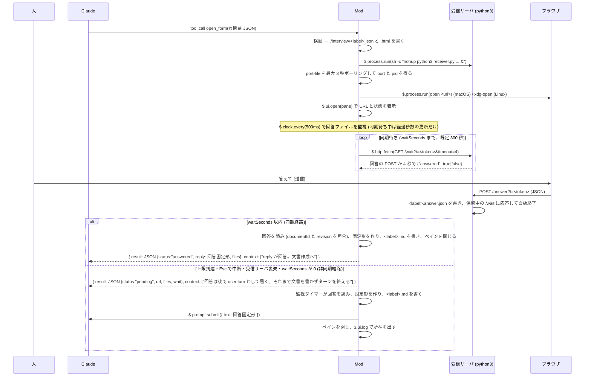

# Document Interview Mod MVP 設計 (M1〜M3、ブラウザ経路)

作成日: 2026-09-22 / 更新: 2026-09-23 (同期待ち、`/wait`、ステータス名、古い回答の削除) / 状態: MVP 実装済み (2026-09-22、実機 E2E 済み)。同期待ちは 2026-09-23 に実装、テストと受信サーバ単体 (python3 + curl) で確認済み、実機 E2E は未 / 前提: [plan.md](plan.md) の 2, 4, 5.2, 5.5, 6, 11 章

## 0. plan.md からの変更点

plan.md の 5 章は「ペインで答える」設計でしたが、2026-09-22 に利用者が「ブラウザの HTML フォームで答え、回答を Mod に POST で戻す」経路を選びました。理由は次の 3 つです。

- ペインの `Input` は 1 行のみで、補足や表を書くには狭い。ブラウザなら複数行と表が普通に書ける。
- akapen のシート規約 (結論ファースト、問いカード、絵) をそのまま HTML で活かせる。
- この経路はスパイク V2, V4, V5, V6 (plan.md 11 章) で実機検証済み。ペインの描画は未検証。

ペインは「URL と状態の表示、ブラウザを開き直すボタン」だけに使います。人が答える面はブラウザです。

## 1. 範囲

MVP は plan.md の F-1〜F-7 です。加えて、ブラウザでは安価なので表 (F-9) と下書きの `localStorage` 保存 (F-10 の簡易版) も入れます。F-8, F-11 (`/interview` は状態表示と開き直しだけ入れる), F-12, F-13, F-14 は後続です。

## 2. ファイル構成

```
plugins/document-interview/
├── .claude-plugin/plugin.json      # name: "document-interview"
├── hooks/
│   ├── hooks.json                  # {"modules": ["./register.ts"]}
│   ├── register.ts                 # register(on): フックの登録と状態機械
│   ├── host/                       # $ を session.start で束ねた関数群 (diff mod の host.ts に倣う)
│   ├── form/                       # 質問票 JSON の型 (form-v1.ts)、検証 (validate.ts)、回答 JSON の読み取り (answer.ts)
│   ├── sheet/                      # 質問票 JSON → 自己完結 HTML (render-html.ts)
│   ├── reply/                      # 回答 JSON + 質問票 → 回答固定形 v1 (format.ts)
│   ├── receiver/                   # 受信サーバの起動引数、前回の回答を消す引数、port-file の読み取り、URL
│   ├── wait/                       # 同期待ち (sync-wait.ts): tool.call の中で /wait をロングポーリング
│   ├── views/                      # ペインの描画 (Box/Text/Button) と固定文言 (strings.ts)
│   └── names.ts                    # PLUGIN_NAME, TOOL_NAME, COMMAND_NAME, PANE_ID
├── scripts/receiver.py             # ローカル受信サーバ (python3 標準ライブラリのみ)
├── tests/
│   ├── register.test.ts            # ツール呼び出し → 受信サーバ起動 → 同期待ち / 回答検知 → prompt.submit
│   ├── sync-wait.test.ts           # 同期待ちの単体 (signal の abort、受信サーバ喪失、差し替え)
│   ├── validate.test.ts            # 質問票の検証規則
│   ├── render-html.test.ts         # HTML の要素と埋め込み JSON
│   ├── format.test.ts              # 回答固定形のゴールデンテキスト
│   └── fixtures/                   # 質問票 JSON、回答 JSON、期待する固定形
├── tsconfig.json                   # include: ["../../.claude/types", "hooks", "tests"]
└── README.md                       # What it hooks / What it calls on $ / Try it
```

`.claude/types/claude-code.d.ts` は `claude -p "/plugin-types"` がリポジトリ直下に生成した型定義 (2.1.278) で、git には入れません (`.gitignore`)。

## 3. 流れ



同期待ちが要る理由: `pending` だけだと Claude のターンが一度終わり、回答は別の user turn として届きます。人が数分で答える普通の場合は、ツールの結果として受け取る方が Claude の文脈が切れず、`-p` 実行やスクリプトからも扱えます。

同期待ちの制約 (claude-code.d.ts の `HookBudget`): フックの予算は 1 ディスパッチ 10 秒ですが、`$` 呼び出しの待ち中は時計が止まります。ただし `$.clock` の待ちは予算に数えられるので、`$.clock.sleep` でのポーリングはできません。そこで受信サーバに `GET /wait` (ロングポーリング) を足し、`$.http.fetch` で 4 秒ずつ保留させます。4 秒なのは、Esc で `next.signal` が abort したあとフックが動けるのが 5 秒 (`lingerMs`) で、`HttpInit` に `signal` が無く fetch を途中で止められないためです。経過秒数は時計を読まず、要求した `timeout` の合計で数えます (受信サーバは要求より長くは保留しません)。

## 4. フックと `$` の呼び出し

| イベント | 絞り込み | すること |
|---|---|---|
| `session.start` | なし | `$` を host に束ねる。`$.tool.register({ name: "open_form", ... })` と `$.command.register({ name: "interview", ... })`。`e.cwd` を保持する |
| `tool.call` | `{ tool: "mcp__document-interview__open_form" }` | 3 章の流れ。検証エラーは `{ result: JSON.stringify({ status: "invalid", errors: [...] }) }` を返す (deny ではない。Claude が直して再送できるように)。結果は文字列 (plan.md V3)。受信サーバ起動前に同じ label の前回の `.answer.json` と `.port.json` を `rm -f` で消す。起動後は `waitSeconds` まで同期待ち (`next.signal.aborted` で打ち切り) |
| `command.run` | `{ command: "interview" }` | 待機中の質問票があればペインを開き直しブラウザも開き直す。無ければ `{ text: "待機中の質問票はありません" }` |
| `ui.render` | `{ component: "Pane" }` かつ `e.requestId === PANE_ID` | 6 章のペインを描く |
| `ui.close` | `{ id: PANE_ID }` | 人が閉じても監視は続ける。`$.ui.status("/interview で開き直せます")`。`next(e)` |

呼び出す `$`: `tool.register`, `command.register`, `fs.write`, `fs.read`, `fs.exists`, `process.run`, `clock.every`, `clock.after`, `clock.now`, `http.fetch` (同期待ちの `/wait`), `ui.open`, `ui.close`, `ui.resolve`, `ui.invalidate`, `ui.log`, `ui.status`, `prompt.submit`。`$.plugin.root` も読みます。`model`, `store` は使いません。README の表は `claude plugin validate` の印字と一致させます。`process.run` は型定義で「CLI only」ですが、Claude Code Desktop (ローカルの Claude Code) でも受信サーバの起動から `answered` まで動きました (2026-09-23 確認)。

規則: `$` を変数に代入したり引数に渡したりしない (validate が拒否する)。`session.start` の中で `run: (argv, init) => $.process.run(argv, init)` のような閉包を作って host にする。

## 5. ツール `open_form` の入力と出力

`inputSchema` は `{ type: "object", properties: { form: <質問票 JSON のスキーマ>, openBrowser: { type: "boolean" }, waitSeconds: { type: "integer", minimum: 0, maximum: 1800 } }, required: ["form"] }`。`openBrowser` の既定は true。false ならブラウザを起動せず URL だけ返す (テストと `-p` 実行用)。`waitSeconds` は呼び出しの中で回答を待つ上限 (秒)。既定 300、0 で待たない (従来どおり即 `pending`)、上限 1800。範囲外は丸め、数でなければ既定。

質問票 JSON スキーマ v1 は plan.md 5.2 節のとおりです。検証規則:

- `schemaVersion === 1`。`documentId` と `label` は `^[A-Za-z0-9_-]{1,64}$`。`revision` は 1 以上の整数。
- `title`, `conclusion` は空でない文字列。`glossary` は省略可。各要素は `term` と `definition`。
- `themes` は 1 つ以上。全テーマの `questions` の合計は 2〜5 問。0〜1 問と 6 問以上は落とす (エラー文に「圧縮してください」)。
- 各問: `id`, `title`, `cite` (空文字は落とす), `options` (2 つ以上)。`note.placeholder` は省略可。
- 各選択肢: `id`, `label`, `pros`, `cons` (どちらも空でない)。`recommended: true` は 1 問に高々 1 つ。
- `tables` は省略可。各表: `id`, `title`, `columns` (1〜6), `rows` (0〜20 行、各行の長さは columns と同じ), `editable` (columns と同じ長さの boolean 配列、省略時は全列 true)。
- ID はテーマ間で一意 (問い ID は全体で一意、表 ID も全体で一意)。
- エラーは配列で全部返す (最初の 1 つで止めない)。パスは `themes[0].questions[1].cite` の形。

出力は `status` で分岐します。従来の `opened` は `pending` に改名しました (意味は「開いた、回答は後で届く」で同じ。`answered` と対になる語にするため)。

| `status` | 中身 | context |
|---|---|---|
| `answered` | `documentId`, `revision`, `reply` (回答固定形), `files: { form, html, answer, md }`。`waitSeconds` 以内に回答が届いた。`prompt.submit` はしない | 「reply が人の回答 (【インタビュー回答】で始まる固定形) です。user turn は届きません。reply を回答として読み、文書の作成に進んでください。」 |
| `pending` | `documentId`, `revision`, `url`, `files: { form, html }`, `wait: { seconds, endedBy }`。`endedBy` は `timeout` (上限到達) / `abort` (`next.signal` が abort) / `receiverLost` (`/wait` に届かない) / `skipped` (`waitSeconds: 0`)。以後は監視タイマーが `prompt.submit` で届ける | 「質問票をブラウザに出しました。回答は後で【インタビュー回答】で始まる user turn として届きます。それまで文書を書かず、このターンを終えてください。」 |
| `cancelled` | `documentId`, `revision`, `reason` (人が [取り消す] を押した / 別の質問票で差し替えられた)。同期待ち中に待機が消えたとき | なし |
| `invalid` | `errors` | なし |
| `failed` | `reason`, `files: { form, html }`。受信サーバが起動できない。HTML は書いてあるので、人が `file://` で開いて JSON を貼る代替導線を reason に書く | なし |

## 6. ペイン

要素は `Box`, `Text`, `Button`, `Link`。行数は 8 行以内。

```
インタビュー: <label>  (rev <revision>)
ブラウザで回答してください:
http://127.0.0.1:<port>/?t=<token>
リンクで開く (localhost)              ← Link (href: http://localhost:<port>/?t=<token>)
状態: 回答を待っています (n 秒経過)
[ブラウザで開く (o)]  [取り消す]
```

- `Link`: terminal では OSC 8 のハイパーリンク、desktop ではアンカーとして描かれる。`Link` の `href` は `https:` か `http://localhost` しか通らず (`127.0.0.1` はテストキットの `$.ui.mount` で「Link href must be https: (or http://localhost)」と拒否されることを確認)、`http://localhost:<port>` は通る。受信サーバは 127.0.0.1 (IPv4) にだけ bind しているので、ブラウザが localhost を `::1` に先に解決しても 127.0.0.1 に切り替わることを当てにする (curl で確認。実ブラウザは未検証)。
- [ブラウザで開く]: `open`/`xdg-open` を再実行。
- [取り消す]: 受信サーバを `kill <pid>` で止め、監視を止め、ペインを閉じ、`$.ui.log("インタビューを取り消しました")`。同期待ち中なら `open_form` が `cancelled` を返す。`pending` のあとなら Claude には何も送らない。
- 経過秒数は `clock.every` のたびに `$.ui.invalidate("ui.render")` で更新する (5 秒ごとで十分)。

## 7. HTML シート

`hooks/sheet/render-html.ts` が質問票 JSON から自己完結の HTML を作ります。akapen の `references/paper-spec-v3.md` の骨格に倣いますが、絵と全体図は MVP では出しません。

- `<!-- document-interview-format: v1 -->` をコメントで残す。
- 外部リソース無し (フォントもシステムフォント)。CSS は `--ink --muted --line --paper --paper-dim --accent --red` の 7 トークン。赤は論点 (問い番号、推奨バッジ) 専任、青は導線 (送信ボタン) 専任。
- 骨格: キッカー `✎ INTERVIEW <日付>` → 主張のタイトル → 結論ボックス → 用語欄 (あれば) → 問いカード (テーマ見出し付き) → 表 → 全体へのコメント (textarea) → 送信ボタンと状態表示。
- 問いカード: `問 n. <title>`、根拠 (`cite`) を Mono で、選択肢は radio (縦並び。ラベルの下に「利点: … / 代償: …」)。推奨には `推奨` バッジ。再クリックで解除できる (grilling-viz)。補足は 1 行 `input` (placeholder は `note.placeholder` か「補足があれば 1 行で」)。
- 表: `editable` の列は `input`、それ以外は固定表示。
- フッター: 「未選択の問いはお任せ (推奨案) で進みます」「回答あり n / m」。
- 送信: `fetch('/answer?t=<token>', { method: 'POST', body: JSON })`。成功で「送信しました。Claude Code に戻ってください。」と出し、フォームを無効化する。失敗時は回答 JSON を textarea に出して「受信サーバが応答しません。下の JSON をそのまま Claude Code のチャットに貼ってください。」と出す (`/interview` は案内しない。`failed` のときは待機中の質問票が無く、`/interview` は何もしないため)。
- 下書き: `localStorage` に `document-interview:<documentId>:<revision>` で保存し、開き直しで復元する。
- 質問票 JSON は `<script type="application/json" id="di-form">` に埋め込む (`<` は `<` に逃がす)。テストはこれを読んで照合する。
- 埋め込む JS は素の JavaScript。TypeScript の関数を `toString()` で埋めない。
- 文言は ja-text-communication の規範 (一文一義、英単語に助詞を直結しない、造語を作らない) に従う。

回答 JSON (ブラウザが POST する形):

```json
{
  "schemaVersion": 1,
  "documentId": "spec-auth-01",
  "revision": 1,
  "answers": { "q1": { "choice": "A", "note": "管理者だけ先行" }, "q2": { "choice": null, "note": "" } },
  "tables": { "tb1": [["トップ", "不要", ""], ["設定", "必要", "二段階認証も"]] },
  "globalNote": "移行の告知文も欲しい",
  "submittedAt": "2026-09-22T12:34:56.000Z"
}
```

## 8. 回答固定形 v1

plan.md 5.5 節のとおり。`hooks/reply/format.ts` が作ります。

```
【インタビュー回答】spec-auth-01
Q1. 既存ユーザーの移行をどう扱いますか: A — 初回ログイン時に自動移行 / 補足: 管理者だけ先行
Q2. ログの保持期間: (未選択 = お任せ)
## 表
### 画面ごとの認証要否
| 画面 | 認証 | 備考 |
|---|---|---|
| トップ | 不要 | |
| 設定 | 必要 | 二段階認証も |
全体へのコメント: 移行の告知文も欲しい
---
上の回答を反映して文書を作成してください。お任せの項目は推奨案で確定してください。
```

規則:

- `Qn.` は質問票の並び順 (テーマ順 → 問い順) で 1 から振る。問い ID ではなく通し番号。
- 選択肢は `<id> — <label>`。補足が空なら ` / 補足:` を省く。未選択で補足だけある場合は `(未選択 = お任せ) / 補足: …`。
- `## 表` は表が 1 つ以上あるときだけ。セルの `|` は `\|` に逃がす。空セルは空のまま。
- `全体へのコメント:` は空なら行ごと省く。人の記述は改変しない。改行は空白 1 つに畳む (表のセルと補足)。全体へのコメントは複数行を許し、そのまま載せる。
- 末尾の `---` と締めの 1 文は不変。
- 回答 JSON に質問票に無い ID があれば無視する。質問票にあって回答に無い問いは未選択として扱う。

回答 JSON は隠し context には添えません。当初は `prompt.submit` フックで `【インタビュー回答 JSON】` として添える設計でしたが、Claude Code 2.1.278 では plugin 自身の `prompt.submit` フックがその plugin の `$.prompt.submit` を見ないことを実測しました (plan.md 11 章 V7)。`$.prompt.submit` の引数にも `context` はありません (`PromptSubmitArgs` は `context` を除いた型)。Claude は `interview/<label>.answer.json` を読んで照合します。

## 9. 受信サーバ `scripts/receiver.py`

スパイク `spikes/mods-spike/scripts/receiver.py` を土台にします。python3 標準ライブラリのみ。

引数: `--port` (既定 0 = OS 任せ), `--port-file` (必須。`{"port": n, "pid": n}` を JSON で書く), `--token` (必須), `--html` (配る HTML のパス), `--out` (回答を書くパス), `--idle-timeout` (秒。既定 3600。回答が無いまま過ぎたら終了)。

経路:

- `GET /?t=<token>` → HTML (200)。トークン不一致は 403。
- `GET /ping?t=<token>` → `{"ok":true}`。
- `GET /wait?t=<token>&timeout=<秒>` → 回答が POST 済みなら即 `{"answered":true}`。未着なら回答の POST か `timeout` (上限 5 秒に丸める) の経過まで応答を保留し、経過なら `{"answered":false}`。Mod の同期待ちが 4 秒ずつ呼ぶ。
- `POST /answer?t=<token>` → 本文を `<out>.tmp` に書いて `os.replace` で `<out>` にし、保留中の `/wait` を `{"answered":true}` で解放し、`{"ok":true}` を返してサーバを終了する。ファイルを書き終えてから `/wait` を解放するので、Mod は `/wait` の応答後にファイルを読める。
- それ以外は 404。
- bind は `127.0.0.1` のみ。ログは出さない。`/wait` と `POST` を同時に捌くため `ThreadingHTTPServer` (`daemon_threads = False`。終了時に応答中の `/wait` を待つ)。idle-timeout で終了するときも保留中の `/wait` を `{"answered":false}` で解放する。

python3 と curl で確かめた結果 (2026-09-23): `timeout=1` の `/wait` は 1.05 秒で `{"answered":false}`、`timeout=4` の保留中に 1 秒後 POST すると 1.05 秒で `{"answered":true}` が返りサーバが終了、`idle-timeout 2` では `timeout=5` の `/wait` が 1.5 秒で解放された。`http://localhost:<port>/ping` は 127.0.0.1 に届いた。

Mod 側の起動: まず `$.process.run(['rm', '-f', '<label>.answer.json', '<label>.port.json'])` で同じ label の前回の回答と port-file を消す (残っていると Mod が前回の回答を新しい回答として拾う)。次に `$.process.run(['sh', '-c', 'nohup python3 "<root>/scripts/receiver.py" ... >/dev/null 2>&1 & echo started'], { timeoutMs: 10000 })`。その後 `port-file` を 250 ms 間隔で最大 3 秒 `fs.exists` → `fs.read` する。`python3` が無ければ `status: "failed"` にする (`python3 --version` を session.start で 1 回確かめ、結果を保持する)。

ファイルの置き場: `./interview/` (セッションの cwd 基準)。`fs.write` が親ディレクトリを作らない場合は `$.process.run(['mkdir', '-p', 'interview'])` を先に実行する (型定義の `fs.write` の説明を読んで決める)。

- 質問票: `interview/<label>.json`
- HTML: `interview/<label>.html`
- port-file: `interview/<label>.port.json`
- 回答: `interview/<label>.answer.json`
- 回答固定形: `interview/<label>.md`

## 10. 状態機械

```
idle --open_form--> waiting(sync) --回答検知 (tool.call の中)--> idle  (結果 answered、prompt.submit しない)
waiting(sync) --waitSeconds 到達 / next.signal abort / 受信サーバ喪失--> waiting(async)  (結果 pending)
idle --open_form (waitSeconds: 0)--> waiting(async)  (結果 pending)
waiting(async) --回答検知 (監視タイマー)--> submitting --prompt.submit 済--> idle
waiting --open_form (別の質問票)--> 前の受信サーバを kill、監視停止 → 新しい waiting (sync 中なら結果 cancelled)
waiting --[取り消す]--> kill、監視停止、ペイン閉 → idle  (sync 中なら結果 cancelled)
waiting --ui.close (人)--> waiting のまま (監視は続く)
waiting --/interview--> ペインとブラウザを開き直す
idle --/interview--> "待機中の質問票はありません"
```

- 同期待ち中は `Pending.isSyncWaiting` を立て、監視タイマーの tick は経過秒数の更新だけ行い回答を届けない。同期待ちを抜けたらフラグを下ろす。これで同じ回答が Tool result と user turn の両方で届くことはない。
- 回答 JSON の `documentId` と `revision` が質問票と一致しなければ無視する (同期待ちと監視タイマーの両方)。別の質問票の回答や、同じ label の古い回答を拾わないため。
- 同じ `documentId` + `revision` の回答を 2 回受け取っても 2 回目は無視する (回答ファイルは検知後すぐ `<label>.answer.json` のまま残し、`pending` を消すことで二重投入を防ぐ)。
- 監視タイマーは `clock.every(500, ...)` 1 本。検知後に `timer.cancel()` (型定義の Timer の止め方に従う)。
- `idle-timeout` で受信サーバが先に死んだ場合、監視は続くが `/ping` はしない (http を使わない)。人が [取り消す] か新しい `open_form` で片付く。

## 11. テスト (`claude plugin test plugins/document-interview`)

テストは `claude-code/testing` の kit で書きます。`$` の下の世界は `on('process.run', ...)`, `on('fs.write', ...)`, `on('fs.read', ...)`, `on('fs.exists', ...)`, `on('http.fetch', ...)`, `on('tool.register', ...)`, `on('command.register', ...)`, `on('ui.open', ...)`, `on('ui.close', ...)`, `on('ui.log', ...)`, `on('ui.status', ...)`, `on('prompt.submit', ...)` で答えます。`mock.clock(on)` で時間を進めます。ファイルはテスト内の `Map<string, string>` で模し、`rm -f` は Map から消します。`http.fetch` は `/wait` の答え (`{ answered }` か失敗) を台本で返します。

最低限のケース:

1. `session.start` でツールとコマンドが登録される (名前を照合)。
2. 正しい質問票で `$.tool.call({ tool: 'mcp__document-interview__open_form', form, openBrowser: false })` を呼ぶと、`interview/<label>.json` と `.html` が書かれ、`process.run` の argv に `receiver.py` と `--token` が含まれ、port-file を模した後に `result` の JSON が `status: "opened"` と URL を持つ。`context` が 1 件ある。
3. 不正な質問票 (6 問、`cite` 空、`recommended` が 2 つ、`pros` 空) で `status: "invalid"` と全エラーが返る。`process.run` は呼ばれない。
4. 回答ファイルを置いて `clock.advance(500)` すると、`prompt.submit` が固定形のテキストで 1 回だけ呼ばれ、`interview/<label>.md` が同じ内容で書かれ、`ui.close` が呼ばれる。もう一度 advance しても 2 回目は呼ばれない。
5. `prompt.submit` フックが origin plugin (自分) のときだけ context を添える。origin composer には添えない。
6. `/interview` が待機中ならペインを開き、待機中でなければその旨の text を返す。
7. `validate.test.ts`: 規則ごとに 1 ケース。
8. `format.test.ts`: fixtures の質問票と回答から期待する固定形 (ゴールデン) と完全一致。表あり・無し、補足あり・無し、全体コメント無しの 4 通り。
9. `render-html.test.ts`: `id="di-form"` の JSON が入力と等しい、問いの数だけ `name="q-<id>"` の radio 群がある、`__TOKEN__` が残っていない (トークンは受信サーバ側で埋めるか、HTML 生成時に埋めるか、一方に決める)。

`$.ui.mount` でペインを描くテストも 1 つ入れる (`surface: 'terminal'`、`Button` の label が「ブラウザで開く」と「取り消す」)。

同期待ちと不具合修正のケース (2026-09-23 に追加):

10. 同じ label の古い `.answer.json` が残っていても `open_form` が消すので拾わない (`rm -f` が受信サーバの起動より前に走る)。
11. 回答 JSON の `documentId` か `revision` が質問票と違えば無視し、一致すれば届ける。
12. 同期待ち中に回答が届くと `answered` と固定形 (`reply`) を返し、`prompt.submit` は呼ばれない。`/wait` は `timeout=4` で呼ぶ。
13. `waitSeconds: 6` が過ぎると `pending` (`wait: { seconds: 6, endedBy: "timeout" }`) を返し (`/wait` は 4 秒 + 2 秒)、その後の回答は `prompt.submit` で 1 回だけ届く。
14. `/wait` に届かないと `pending` (`receiverLost`) を返し、監視は続く。
15. 同期待ち中に [取り消す] を押すと `cancelled` を返し、何も届かない。
16. `waitSeconds: 0` なら `/wait` を呼ばず即 `pending` (`skipped`)。
17. `surface: 'desktop'` の `$.ui.mount` で `Link` の href が `http://localhost:<port>/?t=…`。
18. `sync-wait.test.ts` (単体): `next.signal` が abort すると次の周回で `pending` (`abort`) を返し `/wait` を呼び直さない (テストキットにフックの signal を abort させる手段が無いため、`AbortController` で関数を直接試す)。`/wait` が失敗しても回答ファイルがあれば `answered`。`answered:true` なのに一致する回答が無ければ空回りせず打ち切る。差し替えで `dropped`。

## 12. 静的検証と型

- `CLAUDE_CODE_ENABLE_FUNCTION_HOOKS=1 claude plugin validate plugins/document-interview` が通ること。印字されるフック一覧と `$` 呼び出し一覧を README の表に写す。
- `tsconfig.json` は `/plugin-types` の案内どおり `"include": ["../../.claude/types", "hooks", "tests"]`, `"lib": ["es2023"]`, `"jsx": "react"`, `"jsxFactory": "h"`。`tsc` が使えれば `npx -y typescript tsc -p plugins/document-interview --noEmit` で確かめる。

## 13. 手動確認 (実装後に統合側で行う)

```bash
CLAUDE_CODE_ENABLE_FUNCTION_HOOKS=1 claude --plugin-dir plugins/document-interview
```

対話モードで「tests/fixtures の質問票を open_form で開いて」と頼み、ブラウザで答えて [送信] し、ツールの結果が `answered` で `reply` に【インタビュー回答】が入ることを見ます。`waitSeconds: 0` で頼めば従来どおり user turn として届くことを見ます。

同期待ちで実機で確かめていないこと (2026-09-23 時点):

- `$.http.fetch` が 4 秒応答を保留する `/wait` をそのまま待つか (ホスト側のタイムアウトの有無は型定義に書かれていない)。
- Esc で中断したあと、保留中の fetch が戻ってから `pending` を返すまでが `lingerMs` (5 秒) に収まるか。
- terminal の OSC 8 と desktop のアンカーで `http://localhost:<port>` の `Link` を押したとき、ブラウザが 127.0.0.1 の受信サーバに届くか (`::1` に解決されたときの切り替え)。
- `waitSeconds` の既定 300 秒の間、ツール呼び出しが進行中のままで問題が無いか (表示、他のフックとの干渉)。

## 14. Desktop での確認結果 (2026-09-23)

読み込み方: `~/.claude/settings.json` の `env` に `CLAUDE_CODE_ENABLE_FUNCTION_HOOKS=1` と `CLAUDE_CODE_PLUGIN_DIRS=<plugin の絶対パス>` を書く (プロジェクトの settings は読まれない)。

| 項目 | 結果 |
|---|---|
| hooks とスキルの読み込み | 動いた (`/interview`、`/document-interview:document-interview`) |
| `process.run` (受信サーバの起動、`open`、`rm`) | 動いた。フォームは既定のブラウザで開く |
| 同期待ち → `answered` | 動いた |
| 待機中の中断 | モデルには「ツールの実行が拒否された」と表示され、`pending` の結果は届かない。受信サーバと監視は残り、後から送った回答は `prompt.submit` で user turn として届いた |
| ペインと `Link` | 描かれない。`/interview` で人が求めて開いても出ない (原因は未確定。`$.ui.open` は求められて開いても 110 列未満では描かないので幅の可能性は残るが、Desktop のログに engine の debug 出力が無く確かめられない) |

