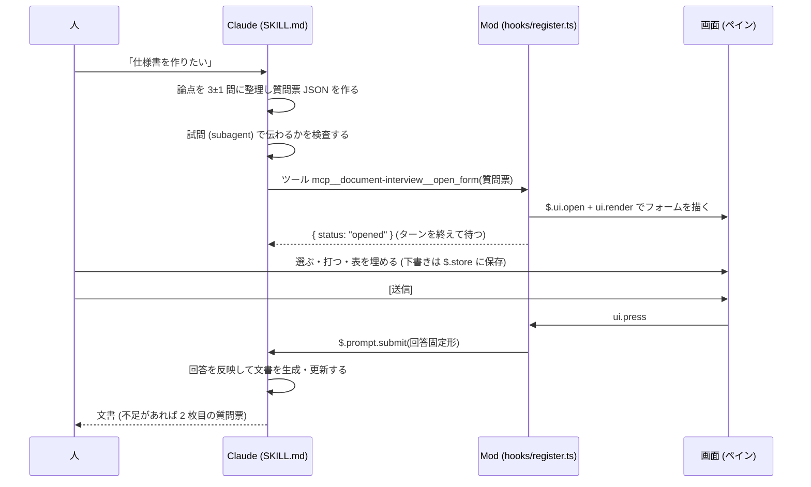

# Document Interview Mod 計画書

作成日: 2026-09-22 / 状態: 計画 (実装前) / 対象: Claude Code 2.1.278 以降の Claude Mods (早期アクセス)

## 要点

- 文書を書く前に Claude が論点を整理し、Claude Code の画面内に一枚のフォーム (選択肢・入力欄・表) として出し、人がまとめて答え、その回答を Claude が読んで設計書・仕様書・企画書・記事を書く仕組みを、Claude Mods として作ります。
- 元ネタは 3 つです。akapen からは「決定だけを人に聞く」出題規律と回答の固定形と試問を、grilling-viz からは質問データの型と安全な更新規則と回答の保持を、ja-text-communication からは質問文と生成文書の日本語規範を引き継ぎます。
- ブラウザで HTML を開いてターミナルに貼り戻す往復を、ペインで答えて [送信] を押す往復に置き換えます。回答は `$.prompt.submit` で Claude に届き、通常のターンとして文書生成に進みます。

## 用語

この計画書で使う語を先に定義します。

| 語 | 意味 |
|---|---|
| Claude Mods (Mod) | function hooks を使う Claude Code の plugin の製品名です。Anthropic の担当者が GitHub issue #91870 (2026-09-09 更新) で命名しました。 |
| function hooks (関数フック) | plugin の `hooks/register.ts` が `on("イベント名", ($, e, next) => ...)` で登録する TypeScript の関数です。`$` はエンジン API、`e` はイベントの引数、`next` は下流のフックとエンジン本体へ処理を渡す継続です。 |
| ペイン (Pane) | Mod が `$.ui.open({ id })` で開く枠付きの画面領域です。全画面レイアウトではトランスクリプトの横に、それ以外ではプロンプトの上に置かれます。 |
| サーフェス (surface) | Claude Code を描く場所です。`terminal`、`desktop` (Claude Code Desktop)、`vscode`、`mobile` の 4 つがあります。 |
| 質問票 (form) | Claude が論点を整理して作る JSON データです。この Mod はこれを描き、回答を集めます。 |
| 回答固定形 | 人の回答を Claude が読むための、決まった形のテキストです。akapen の【赤ペン回答】と同じ文法にします。 |
| 試問 (preflight) | 質問票を人に見せる前に、文脈を持たない subagent に読ませて伝わるかを検査する手順です。akapen から引き継ぎます。 |
| お任せ | 人が選択肢を選ばなかった状態です。Claude は推奨案で確定します。 |

## 1. 背景と目的

### 1.1 いまの往復と、その限界

akapen と grilling-viz はどちらも「質問を HTML 1 枚にしてブラウザで開き、人が答え、生成されたテキストをターミナルに貼る」往復です。この往復は次の点で重いです。

- 人がブラウザとターミナルを行き来します。回答のテキストをコピーして貼る操作が毎回入ります。
- HTML は `file://` で自己完結させる制約があり、画像や絵を data URI か絶対 URL で埋め込む必要があります。
- 回答の下書きは `localStorage` に残りますが、Claude 側からは見えません。

ja-text-communication は日本語で書くときの規範集で、UI や往復の仕組みは持ちません。質問文と生成文書の品質を上げる材料として使います。

### 1.2 Mods で変わること

Claude Mods は Claude Code の画面内に plugin が UI を描き、人の操作 (押す・選ぶ・打つ) をフックで受け取り、`$.prompt.submit` で Claude に user turn を投入できます。これにより往復は「ペインで答えて [送信]」だけになります。根拠は付録 A の型定義です。

### 1.3 目的

1. 文書作成前の論点整理を、人の判断コストを最小にした一枚のフォームで行えるようにします。
2. 人の回答を、コピーと貼り付けなしで Claude に渡せるようにします。
3. 回答をもとに Claude が文書を生成・更新する手順を、スキル (SKILL.md) として固定します。

## 2. 元ネタから引き継ぐもの

### 2.1 akapen から引き継ぐもの

| 良いところ | Mod での置き場所 |
|---|---|
| 事実を人に聞かず、決定 (好み・優先度・トレードオフの裁定) だけを聞く。各問に `file:line` か実行結果の引用を添える | SKILL.md の出題規律。質問票 JSON の `cite` 欄を必須にする |
| 決めてほしいことは 3±1 問。未選択はお任せ、推奨案に印を付ける | 質問票 JSON の `recommended`。フォームの初期状態は未選択で、フッターに「未選択はお任せ」と明記する |
| 非推奨の選択肢にも「選ぶ理由 (利点)」を 1 行書く。利点と代償を各 1 行 | 質問票 JSON の `pros` と `cons`。両方が空の選択肢は検証で落とす |
| 結論ファースト (キッカー → 主張のタイトル → 結論 3 文) | ペインの先頭。`conclusion` 欄 |
| 用語欄 (読者が知らない語だけ 1 行ずつ) | 質問票 JSON の `glossary`。ペインの結論の直下 |
| 【赤ペン回答】の固定形と、末尾の `---` + 締めの 1 文 | 回答固定形 v1 (5.5 節)。文法を揃えて Claude 側の読み方を 1 つにする |
| 出題前の試問 (文脈ゼロの subagent に 5 問) | SKILL.md の手順。質問票を Markdown に落として渡す |
| 回答が届く前に実装を始めない | SKILL.md の禁則。ツールの返答 `context` でも Claude に念押しする |
| 証跡として HTML を残す | 質問票 JSON と回答固定形を `./interview/<label>.json` と `.md` に保存する |
| 指摘モード (段落ごとにチップ 7 種 + ひとこと) | 後続マイルストーン M6 のレビューモード |

引き継がないもの: `file://` の HTML、Google Fonts、7 色トークン、クリップボードへのコピー、`crypto.randomUUID` 禁止などブラウザ固有の注意書きは、ペイン UI では不要になります。ただし HTML シートはフォールバック (5.9 節) として残します。

### 2.2 grilling-viz から引き継ぐもの

| 良いところ | Mod での置き場所 |
|---|---|
| 質問データを JSON にし、生成前に検証する (`validateDocument`) | 質問票 JSON スキーマ v1 (5.2 節) と `hooks/form/validate.ts` |
| `documentId` を固定し、更新時に `--if-match` (SHA-256) で上書き事故を防ぐ | 質問票の `documentId` と `revision`。2 枚目は `revision` を進める |
| 質問や選択肢の意味が変わったら質問 ID を新しくし、旧回答を流用しない | 下書き復元の規則 (5.6 節) |
| 回答は `schemaVersion` 付きで保存し、復元に失敗した部分だけ捨てる | `$.store` の下書き形式 |
| テーマ (章) ごとの一覧と、未回答・回答ありのフィルター | ペインのテーマ切替 (Select) と進捗表示 |
| 選択肢は縦に並べ、再クリックで解除し、自由入力欄を常に置く | 質問カードの部品構成 |
| 自動コピー失敗時の手動コピー導線 | 送信失敗時の代替導線 (回答固定形を `$.ui.log` でトランスクリプトに出す) |
| デザイン値に用途ラベルを付けて管理する | ペインの色と幅の定数 `hooks/views/tokens.ts` に用途コメントを付ける |
| キーボード操作 (矢印・Enter・Space) と aria | ペインのフォーカスリング (`autoFocus`、`hotkey`) の設計 |

引き継がないもの: `render.mjs` の HTML 生成と `localStorage` は、ペイン UI と `$.store` に置き換わります。ただし HTML フォールバックの生成には `render.mjs` の考え方を再利用します。

### 2.3 ja-text-communication から引き継ぐもの

| 規範 | Mod での適用点 |
|---|---|
| A1, A3, A5: 用語・内部要素は初出で定義し、成果物ごとに再導入する | 質問票の `glossary` 欄を SKILL.md で必須化する。Claude が作った ID や記号名を質問文に出さない |
| B2, B4: 英単語に助詞を直結しない、造語を作らない | SKILL.md の質問文チェック表 (5.7 節) |
| C1, C2, C4: 一文一義、主語を省かない、表のセルに未説明の圧縮句を置かない | 質問文・選択肢・表の列名の書き方の規則 |
| D4: 数値には単位・分母・範囲を添える | 判断材料の数値の書き方。`cite` 欄に範囲を書く |
| E2, E7: 要点先行、確認質問には判断材料を添える | 結論ボックスと、選択肢ごとの `pros` と `cons` |
| F2, F3: 推測と事実を分け、一次情報を優先する | `cite` 欄の必須化と、試問の「引用の有無」検査 |
| H1: ユーザーの指定語を一字一句そのまま使う | 回答固定形に人の自由記述を改変せず載せる |
| 全体: 生成文書の文章規範 | 文書生成の手順で ja-text-communication スキルを参照する |

## 3. 全体像



流れは 6 段階です。

1. 人が文書作成を依頼します。
2. Claude が SKILL.md の手順で論点を整理し、質問票 JSON を作り、試問で検査します。
3. Claude がツール `open_form` を呼びます。Mod はペインを開き、すぐに「開いた」と返します。Claude はターンを終えて待ちます。
4. 人がペインで答えます。途中の状態は `$.store` に下書きとして残ります。
5. 人が [送信] を押すと、Mod が回答固定形を `$.prompt.submit` で投入します。セッションが待機状態になった時点で user turn として実行されます。
6. Claude が回答を読み、文書を生成・更新します。不足があれば 2 枚目の質問票を出します。

## 4. 機能要件

優先度は MVP (最初に動かす範囲) と 後続 (MVP の後) の 2 段階です。

| ID | 要件 | 優先度 |
|---|---|---|
| F-1 | Claude が質問票 JSON を渡してフォームを開けるツール `open_form` を提供する | MVP |
| F-2 | ペインに結論・用語欄・質問カード (問い、選択肢、利点と代償、引用、補足入力) を描く | MVP |
| F-3 | 選択肢を選ぶ・解除する、補足を 1 行で打つ、全体コメントを打つ | MVP |
| F-4 | [送信] で回答固定形を `$.prompt.submit` に渡し、ペインを閉じる | MVP |
| F-5 | 未選択はお任せとして扱い、フッターで進捗 (回答あり n / m) を示す | MVP |
| F-6 | 質問票 JSON を検証し、不正なら Claude にエラーを返す (人には出さない) | MVP |
| F-7 | 質問票と回答を `./interview/<label>.json` と `.md` に証跡として保存する | MVP |
| F-8 | テーマ (章) 切替と未回答フィルター | 後続 |
| F-9 | 表 (行 × 列) の入力。セルは 1 行の Input | 後続 |
| F-10 | 下書きを `$.store` に保存し、同じ `documentId` のフォームを開き直したら復元する | 後続 |
| F-11 | `/interview` コマンドで直近のフォームを開き直す、状態を見る | 後続 |
| F-12 | desktop と vscode サーフェスでの表示確認 (desktop では Svg で対立軸の絵を出す) | 後続 |
| F-13 | レビューモード: 生成した文書をペインに出し、段落ごとにチップ 7 種とひとことで指摘を返す | 後続 |
| F-14 | HTML フォールバック: Mods が使えない環境では akapen 方式のシートを出す | 後続 |

## 5. 設計

注記 (2026-09-22): MVP は本章の「ペインで答える」設計ではなく、ブラウザの HTML フォームで答えて受信サーバに POST で戻す経路で実装します。利用者がスパイク V2, V4〜V6 の結果を見て選びました。実装仕様は [mvp-design.md](mvp-design.md) にあり、食い違う箇所は mvp-design.md が優先します。本章の 5.2 節 (スキーマ) と 5.5 節 (回答固定形) はそのまま使います。

### 5.1 ファイル構成

`plugins/document-interview/` に置きます。plugin の形は Anthropic の `mods/diff` に倣います。

```
plugins/document-interview/
├── .claude-plugin/plugin.json      # name, description, version, types
├── hooks/
│   ├── hooks.json                  # {"modules": ["./register.ts"]}
│   ├── register.ts                 # register(on): フックの登録だけ
│   ├── form/                       # 質問票 JSON の型と検証 (grilling-viz の answer.js に相当)
│   ├── answers/                    # 回答の状態、下書き、回答固定形の整形
│   ├── views/                      # ペインの描画 (Box/Text/Select/Input/Button)
│   │   └── tokens.ts               # 幅・色・行数の定数に用途コメント
│   └── host/                       # $ を session.start で束ねた関数群 (diff の host.ts に相当)
├── skills/document-interview/
│   ├── SKILL.md                    # Claude 側の手順: 論点整理、試問、反映
│   └── references/
│       ├── form-spec-v1.md         # 質問票 JSON の書き方
│       ├── reply-format-v1.md      # 回答固定形の契約
│       └── question-lint.md        # ja-text-communication に基づく質問文の検査表
├── tests/
│   ├── register.test.ts            # claude plugin test で実行
│   └── fixtures/
└── README.md                       # What it hooks / What it calls on $ の表
```

`plugin.json` の `types` は、この Mod が `$` に名詞を足さない限り不要です。まず足しません。

### 5.2 質問票 JSON スキーマ v1

grilling-viz の `themes / questions / options` を土台に、akapen の問いカードの欄を足します。

```json
{
  "schemaVersion": 1,
  "documentId": "spec-auth-01",
  "revision": 1,
  "label": "spec-auth-01",
  "title": "認証方式は OIDC に寄せる",
  "conclusion": "結論: 認証は OIDC に統一します。自前のセッション管理は捨てます。移行期間は 2 週間です。",
  "glossary": [
    { "term": "OIDC", "definition": "OpenID Connect。OAuth 2.0 の上で認証を行う標準です。" }
  ],
  "themes": [
    {
      "id": "t1",
      "name": "方式",
      "questions": [
        {
          "id": "q1",
          "title": "既存ユーザーの移行をどう扱いますか",
          "cite": "src/auth/session.ts:40-88 に自前セッションの発行があります",
          "options": [
            { "id": "A", "label": "初回ログイン時に自動移行", "pros": "利用者の操作が増えません", "cons": "移行失敗時の切り分けが難しくなります", "recommended": true },
            { "id": "B", "label": "全員に再登録を求める", "pros": "実装が単純です", "cons": "離脱が増えます" }
          ],
          "note": { "placeholder": "補足があれば 1 行で" }
        }
      ]
    }
  ],
  "tables": [
    {
      "id": "tb1",
      "title": "画面ごとの認証要否",
      "columns": ["画面", "認証", "備考"],
      "rows": [["トップ", "", ""], ["設定", "", ""]],
      "editable": [false, true, true]
    }
  ],
  "globalNote": { "label": "全体へのコメント" }
}
```

検証の規則は次のとおりです。

- `schemaVersion` は 1 です。`documentId` と `label` は 1〜64 文字の英数字と `-` と `_` です。
- `questions` は全テーマ合わせて 2〜5 問です。6 問以上は検証で落とし、Claude に「圧縮してください」と返します。
- 各問に `cite` が必要です。空なら落とします。事実を人に聞かないための強制です。
- 各選択肢に `pros` と `cons` が必要です。`recommended` は 1 問に高々 1 つです。
- ID はテーマ内、問い内で一意です。ID が変わった問いの下書きは復元しません。

### 5.3 画面構成

terminal のペインを基準にします。desktop と vscode も同じ要素で描けます。mobile には Input と Select がないため、この Mod は描きません (`session.surfaces()` で判定して `$.ui.log` に案内を出します)。

```
┌ interview: spec-auth-01 ─────────────────────── 回答あり 1 / 3 ┐
│ 結論: 認証は OIDC に統一します。…                              │
│ 用語: OIDC = OpenID Connect。…                                 │
│ テーマ: [方式 ▾]                                               │
│                                                                │
│ 問 1. 既存ユーザーの移行をどう扱いますか            (未回答)   │
│   根拠: src/auth/session.ts:40-88 に自前セッションの発行が…    │
│   [A: 初回ログイン時に自動移行 ▾]  ← 推奨: A                   │
│     A 利点: 利用者の操作が増えません / 代償: 切り分けが難しく… │
│     B 利点: 実装が単純です / 代償: 離脱が増えます              │
│   補足: [________________________________]                      │
│   [選択を解除 (お任せに戻す)]                                   │
│                                                                │
│ 表: 画面ごとの認証要否                                          │
│   画面      認証        備考                                    │
│   トップ    [______]    [__________]                            │
│   設定      [______]    [__________]                            │
│                                                                │
│ 全体へのコメント: [________________________________]            │
│ 未選択の問いはお任せ (推奨案) で進みます                        │
│ [下書きを消す]                                    [送信 (s)]   │
└────────────────────────────────────────────────────────────────┘
```

部品の対応は次のとおりです。

| 画面の要素 | 使う要素 | 補足 |
|---|---|---|
| 結論、用語、根拠、利点と代償 | `Text`、`Markdown` | 折り返しは `wrap="wrap"`。長い引用は `Code` に入れます |
| 選択肢 | `Select` (値 = 選択肢 ID) | 未選択の状態を表す値 `""` を先頭に置きます。desktop でも同じ `Select` を使います (決定 Q2) |
| 補足、表のセル、全体コメント | `Input` | 1 行のみです。長文は「チャットで補足」を案内します |
| 選択を解除、下書きを消す、送信 | `Button` | 送信には `hotkey: "s"` を付けます。送信前に未回答数を表示します |
| テーマ切替 | `Select` | テーマが 1 つなら描きません |
| 進捗 | `Text` | 回答あり n / m。grilling-viz のフッターに倣います |

対立軸の絵 (akapen の `.ab`) は terminal では描けません。terminal では利点と代償の文で弁別できることを試問で確かめます。desktop と vscode では `Svg` 要素で絵を出せるので、後続 F-12 で扱います。

### 5.4 フックと `$` の呼び出し

| イベント | フックがすること |
|---|---|
| `session.start` | `$` を束ねて host を作り、`$.tool.register({ name: "open_form" })` と `$.command.register({ name: "interview" })` を行います。サーフェスが mobile だけなら登録しません |
| `tool.call` (tool: `mcp__document-interview__open_form`) | 入力を検証し、質問票を状態に置き、`$.ui.open({ id: "interview", title, focus: true })` を呼び、`{ result: JSON.stringify({ status: "opened", documentId }), context: ["回答が届くまで文書を書かないでください"] }` を返します。検証エラーは `{ result: JSON.stringify({ status: "invalid", errors }) }` で Claude に返します。plugin ツールの結果は文字列か content ブロックの配列に限られます (11 章 V3) |
| `ui.render` (component: `Pane`, requestId: `interview`) | `$.ui.resolve(e)` で要素表を受け取り、5.3 節の画面を描きます。`e.props.bodyColumns` で幅を決めます |
| `ui.select`, `ui.input`, `ui.press` | 要素の `onSelect`, `onInput`, `onPress` が Mod 内で走ります。状態を更新し `$.ui.invalidate("ui.render")` で再描画します。下書きは `$.store.set` に書きます |
| [送信] の `onPress` | 回答固定形を作り、`$.fs.write` で証跡を保存し、`$.prompt.submit({ text })` を呼び、`$.ui.close({ id: "interview" })` でペインを閉じます |
| `prompt.submit` (origin: plugin, name: 自分) | 回答の JSON を `context` に添えて `next` に渡します。人には見えず Claude だけが読みます |
| `ui.close` (id: `interview`) | 人が閉じたときは下書きを保持し、`$.ui.status` に「/interview で開き直せます」と出します |
| `command.run` (command: `interview`) | 直近の質問票を開き直します。無ければその旨を返します |

呼び出す `$` の名詞は `tool`、`command`、`ui`、`prompt`、`store`、`fs`、`session`、`clock` です。`process`、`http`、`model` は使いません。使う名詞を README に列挙し、`claude plugin validate` の報告と一致させます。

### 5.5 回答固定形 v1

akapen の【赤ペン回答】と同じ文法にし、見出し語だけを変えます。1 行目と末尾の 2 行は不変です。

```
【インタビュー回答】spec-auth-01
Q1. 既存ユーザーの移行をどう扱いますか: A — 初回ログイン時に自動移行 / 補足: 管理者だけ先行
Q2. ログの保持期間: (未選択 = お任せ)
## 表
### 画面ごとの認証要否
| 画面 | 認証 | 備考 |
|---|---|---|
| トップ | 不要 | |
| 設定 | 必要 | 二段階認証も |
全体へのコメント: 移行の告知文も欲しい
---
上の回答を反映して文書を作成してください。お任せの項目は推奨案で確定してください。
```

規則は次のとおりです。

- `Qn.` の行は質問票の並び順です。補足が空なら ` / 補足:` を省きます。
- `## 表` は表が 1 つ以上あるときだけ出します。空のセルは空のまま載せます。
- 人の自由記述は一字一句そのまま載せます (H1)。改行は空白 1 つに畳みます。
- 同じ内容の JSON を `context` に添えます。Claude は表示された固定形を正とし、JSON は照合に使います。

### 5.6 状態と永続化

- 状態は `register` の関数スコープに持ちます。質問票、回答、ペインの開閉、テーマの選択です。
- 下書きは `$.store.set("draft:" + documentId, { schemaVersion: 1, revision, answers })` に書きます。復元は同じ `documentId` かつ問い ID が一致する回答だけです。
- 証跡は `./interview/<label>.json` (質問票) と `./interview/<label>.md` (回答固定形) に `$.fs.write` で残します。akapen が HTML を残すのと同じ役割です。
- store の上限は 4 MiB です。質問票は store に置かず、証跡ファイルから読み直します。

### 5.7 SKILL.md の役割

Claude 側の手順は SKILL.md に書きます。Mod は描画と回収だけを担います。

1. 現物把握。既存の文書やコードから事実を集め、`cite` に書ける形にします。
2. 論点の圧縮。決定だけを 3±1 問に絞ります。事実で決まる問いは自分で調べて消します。
3. 質問文の検査。`references/question-lint.md` の表で自己検査します。主な項目は次のとおりです。

| 項目 | 規範 | 検査 |
|---|---|---|
| 用語 | A1, A3, A5 | 初出の語は `glossary` にあるか。Claude が作った ID や記号名を問いに出していないか |
| 表現 | B2, B4 | 英単語に助詞を直結していないか。造語や口語がないか |
| 一文一義 | C1, C2 | 問いは 1 文か。主語が省かれていないか |
| 表 | C4 | 列名の意味を `title` か注記で説明しているか |
| 数値 | D4 | 単位・分母・範囲があるか |
| 判断材料 | E7 | 各選択肢に利点と代償があるか。非推奨にも選ぶ理由があるか |
| 根拠 | F2, F3 | `cite` は一次情報か。推測を事実のように書いていないか |

4. 試問。`Agent` ツールで文脈ゼロの subagent を立て、質問票を Markdown に落として渡し、akapen の 5 問のうち絵に関する検査を「利点と代償の文だけで選択肢を弁別できるか」に置き換えて聞きます。同期で待ち、計 2 巡で打ち切ります。
5. `open_form` を呼び、ターンを終えます。回答が届くまで文書を書きません。
6. 回答の反映。`references/reply-format-v1.md` の規則で読み、お任せは推奨案で確定し、文書を書きます。文章規範は ja-text-communication に従います。
7. 2 枚目。設計が変わる回答なら `revision` を進めた質問票を作り、捨てた案を残します。

### 5.8 ja-text-communication の適用点

- 質問票: 5.7 節の検査表を通します。
- ペインの文言: Mod が描く固定文言 (「未選択の問いはお任せ」など) も規範に沿って書き、`views/` に定数として集めます。
- 回答固定形: 人の記述は改変しません。
- 生成文書: SKILL.md から ja-text-communication スキルを参照し、要点先行と一文一義で書きます。
- 完了報告: 証跡ファイルの所在を絶対パスで示します (G1)。

### 5.9 フォールバック

次の環境では Mod が動きません。

- `CLAUDE_CODE_ENABLE_FUNCTION_HOOKS=1` が無い (GrowthBook の既定は off)
- mobile サーフェスだけが接続されている
- `-p` 実行や SDK 実行 (人がいない)

このとき SKILL.md は akapen 標準モードの HTML シートに切り替えます。質問票 JSON から HTML を作る `scripts/render-html.mjs` を後続 (F-14) で用意し、grilling-viz の `render.mjs` の検証と `--if-match` の考え方を再利用します。回答固定形は同じなので、Claude 側の読み方は変わりません。

## 6. 非機能要件と制約

| 項目 | 値 | 影響 |
|---|---|---|
| フックの時間予算 | 1 ディスパッチ 10 秒。`$` 呼び出し中は止まるが `$.clock` の待ちは予算に入る | `$.process.run` で待つ分は数えられません (11 章 V1, V3 で実測)。`$.clock.sleep` で待つ設計は避けます |
| 描画ツリーの上限 | 20,000 ノード、深さ 32、直列化 100,000 文字 | 質問は 5 問まで、表は 20 行 × 6 列までに制限します |
| `$.store` の上限 | 4 MiB | 下書きだけを置きます |
| `Input` | 1 行のみ | 長文の補足は「チャットで補足」に誘導します |
| サーフェス | terminal, desktop, vscode | mobile は非対応です。claude.ai の Web 版は対象外です |
| 有効化 | `CLAUDE_CODE_ENABLE_FUNCTION_HOOKS=1` と `--plugin-dir` | marketplace 配布は未対応です |
| API の安定性 | 早期アクセス。予告なく変わる | `/plugin-types` で型を再生成し、`claude plugin validate` を CI で回します |
| 日本語の幅 | terminal は全角 2 セル | 列幅の計算は `bodyColumns` を基準に全角幅で行います |

## 7. テスト計画

| 種類 | 方法 | 主な確認 |
|---|---|---|
| 静的検証 | `claude plugin validate plugins/document-interview` | フックと `$` の呼び出しが README の表と一致すること |
| 単体 | `claude plugin test` の `test(name, async ($, on) => ...)` | 質問票の検証、回答固定形の整形 (ゴールデンテキスト)、下書きの復元規則 |
| 画面 | `$.ui.mount({ plugin, surface })` を terminal と desktop で回す | 要素が描かれること、`ui.select` と `ui.input` と `ui.press` で状態が変わること、送信で `prompt.submit` が呼ばれること |
| 手動 | `CLAUDE_CODE_ENABLE_FUNCTION_HOOKS=1 claude --plugin-dir plugins/document-interview` | ペインの見た目、フォーカス移動、ホットキー、閉じて開き直し |
| スキル | `claude plugin eval` (任意) | 依頼文から質問票を作る手順が 3±1 問と `cite` を守ること |

## 8. マイルストーン

| 番号 | 内容 | 成果物 | 完了条件 |
|---|---|---|---|
| M0 | 仕様調査 | 本計画書、`docs/document-interview-mod/` | 完了 (2026-09-22) |
| M1 | 骨組み | `plugin.json`, `hooks.json`, `register.ts`, 空のペイン | `validate` が通り、`/interview` で空のペインが開く |
| M2 | 質問票の描画 | `form/`, `views/`, F-1, F-2, F-6 | 固定の質問票 JSON がペインに描ける |
| M3 | 回答の回収と送信 | `answers/`, F-3, F-4, F-5, F-7 | [送信] で回答固定形が user turn として届く |
| M4 | スキル | SKILL.md, references 3 本, 試問 | 依頼文から質問票を作り、回答を反映して文書が出る |
| M5 | 表・下書き・desktop | F-8, F-9, F-10, F-11, F-12 | desktop でも同じ流れが動く |
| M6 | レビューと代替 | F-13, F-14 | 生成文書への指摘が固定形で戻る。フラグ無しの環境で HTML に切り替わる |
| M7 | 配布 | marketplace 対応後に README と `claude plugin install` | Anthropic の配布機構の公開待ち |

M1 から M3 までが MVP です。

## 9. リスクと対策

| リスク | 対策 |
|---|---|
| API が予告なく変わる | 型を `/plugin-types` で再生成し、変更点を `docs/document-interview-mod/api-notes.md` に記録します。Claude Code のバージョンを README に明記します |
| フラグの既定が off のままユーザーが使う | SKILL.md が `$.session` に頼らず、ツールの存在で判定して HTML フォールバックに切り替えます |
| 1 行の Input では補足が書けない | 補足は 1 行に限定し、長文は送信後にチャットで受けます。回答固定形に「補足はチャットで続く」の行を許します |
| 質問が長く terminal に収まらない | ペインはスクロールします。テーマ切替で 1 画面に 2〜3 問だけ出します |
| 人が答えずに別の作業を始める | ペインは残り、`/interview` で戻れます。Claude は回答が届くまで文書を書きません |
| 送信が 2 回押される | 送信後はボタンを無効にし、`documentId` と `revision` で二重投入を無視します |
| コミュニティ記事の誤情報 | 根拠は付録 A の一次情報に限定します |

## 10. 決定事項

2026-09-22 に、akapen の流儀で挙げた 4 問すべてについて推奨案を採用しました。

| 問い | 決定 | 理由 |
|---|---|---|
| Q1. 置き場所 | A. `plugins/document-interview/` (このリポジトリ内) | vendor の元ネタと並べて差分を追えます。使うときは `--plugin-dir` で指定します |
| Q2. 選択肢の部品 | A. `Select` 1 つ (値 = 選択肢 ID) | 全サーフェスで同じ挙動で、行数が少なくて済みます。利点と代償の文は Select の外に描きます |
| Q3. 回答の見せ方 | A. 回答固定形の全文を user turn の本文にし、JSON を隠し context に添える | トランスクリプトに何を答えたかが残ります |
| Q4. レビューモード (F-13) の範囲 | A. 最初の範囲に含めず、M6 で扱う | MVP を小さく早く動かします。生成文書への指摘は当面チャットで受けます |

採用しなかった案は次のとおりです。Q1 は `~/.claude/skills/` への配置、Q2 は選択肢ごとの `Button`、Q3 は本文 1 行と隠し context だけ、Q4 は最初から含める案でした。

## 11. 検証結果 (スパイク、2026-09-22)

`spikes/mods-spike/` と `spikes/mods-spike-v3/` の plugin を、Claude Code 2.1.278 に `CLAUDE_CODE_ENABLE_FUNCTION_HOOKS=1` を付けた非対話モード (`claude -p --plugin-dir`) で実行しました。数値はそのときの実測です。

| 番号 | 検証したこと | 結果 | 実測 |
|---|---|---|---|
| V1 | タイマーの中で 15 秒の `$.process.run` を待つ | 完走した。フック予算 10 秒に数えられない | 15,023 ms |
| V2 | `sh -c "nohup ... >/dev/null 2>&1 &"` で切り離した子を起動する | すぐ戻った。受信サーバの常駐起動に使える | 40 ms |
| V3 | `tool.call` の中で 20 秒待ってから結果を返す (同期型) | 待てた。ただし結果の形が文字列か content ブロック配列でないとモデルにエラーが届く | 20,021 ms |
| V4 | 受信サーバを起動し、フォームを GET、回答を POST、回答ファイルを検知する | 全段階が通った | 起動から検知まで 1,537 ms |
| V5 | 回答検知後に `$.prompt.submit` で user turn を投入する | 投入され、モデルが「受信確認」と応答した。origin は `{ kind: "plugin", name }` | 2 ターン目 1,392 ms |
| V6 | 実ブラウザ (Claude デスクトップアプリ内蔵の Chromium) でフォームを開き [送信] を押す | 同一オリジンの `fetch` POST が 200 で返り、回答ファイルが書かれ、受信サーバが自動終了した | 回答は `{"answers":{"q1":"B"},"note":"..."}` |
| V7 | MVP 実装 (plugins/document-interview) を `claude -p` で通しで実行: open_form → 受信サーバ → 内蔵ブラウザで送信 → 回答検知 → `$.prompt.submit` | 全段階が通り、2 ターン目に `【インタビュー回答】` の固定形がそのまま届いた。ただし plugin 自身の `prompt.submit` フックは自分の投入を見ないため、隠し context は付かない (`config.set` の origin plugin の説明「その plugin 自身のフックは見ない」と同じ扱い) | 回答検知から 2 ターン目まで約 8 秒 (待機ループの粒度 2 秒を含む) |

V3 の補足: `{ result: JSON.stringify(...) }` と `{ result: [{ type: "text", text }] }` はモデルに届き、`{ result: { content: [...] } }` は「出力の形に合わない」と拒否されます。

実装上の規則も 2 つ分かりました。

- `$` を変数に代入したり引数に渡したりすると `claude plugin validate` が拒否します。`$.fs.write(...)` のように呼び出し位置で必ず `$.名詞.イベント(...)` と書き、後で使う場合は `session.start` の中で `text => $.fs.write(path, text)` のような閉包を作ります。
- `claude plugin validate` はフックの一覧と `$` の呼び出し一覧を印字します。README の「What it hooks / What it calls on `$`」はこの出力と一致させます。

V6 の補足: Chrome 拡張 (Claude in Chrome) は接続できなかったため、内蔵ブラウザで代替しました。ブラウザ側の表示は「送信しました。ターミナルに戻ってください。」で、ネットワークログにも `POST /answer?t=test → 200 OK` が残りました。既定のブラウザで開く場合も同一オリジンの `fetch` なので動作は同じと見ています。

V7 の補足: 決定 Q3 の「JSON を隠し context に添える」は成立しないので、回答 JSON は `interview/<label>.answer.json` を Claude が読む形に変えました。`$.fs.write` は親ディレクトリ `interview/` を作りました (mkdir は不要)。

未検証のまま残るのは、対話モードでのペインの描画とフォーカス移動、[取り消す] ボタンの押下です (テストキットの `$.ui.mount` と `$.ui.press` では通っています)。

受信サーバのプロトタイプは `spikes/mods-spike/scripts/receiver.py` と `form.html` にあります。トークン無しの GET は 403、POST 1 件でファイルに書いて自動終了します。

## 付録 A. 根拠にした一次情報

| 資料 | 所在 | 使った箇所 |
|---|---|---|
| Claude Mods の提案と経緯 | https://github.com/anthropics/claude-code/issues/91870 | 命名、出荷予定、有効化フラグ |
| 組み込み mod の実装と README | https://github.com/anthropics/claude-code/tree/main/mods | ファイル構成、`diff` mod のペイン描画、テストの書き方 |
| 型定義 `claude-code.d.ts` (2.1.277 が生成) | https://github.com/anthropics/claude-code/blob/main/mods/types/claude-code.d.ts | 要素、イベント、`$` の名詞、上限値、時間予算 |
| ローカルの Claude Code 2.1.278 | `~/.local/share/claude/versions/2.1.278` | フラグ `CLAUDE_CODE_ENABLE_FUNCTION_HOOKS`、`claude plugin test` の存在 |
| akapen 0.2.0 | `vendor/masao/akapen-skills-0.2.0/akapen/` | SKILL.md、`references/paper-spec-v3.md`、`reply-format.md`、`preflight.md`、`assets/shiteki/README.md` |
| grilling-viz | `vendor/mathbullet/plugins/grilling-viz/skills/grilling-viz/` | SKILL.md、`scripts/answer.js`、`scripts/components.js`、`scripts/render.mjs`、`design-system/tokens.css` |
| ja-text-communication | `vendor/mathbullet/plugins/ja-text-communication/skills/ja-text-communication/SKILL.md` | A〜H の規範 |

## 付録 B. 型定義から確認した要点

- 要素表: 全サーフェス共通は `Box`, `Text`, `Button`, `Link`, `Code`, `Markdown`。`Input` と `Select` は mobile 以外。`Svg` は desktop, vscode, mobile。`Client` (plugin 自前の描画モジュール) は terminal と desktop。
- `Button` の props: `key`, `label`, `hotkey` (数字 1 桁か小文字 1 字), `plain`, `autoFocus`, `onPress`。
- `Input` の props: `key`, `label`, `placeholder`, `value`, `submitLabel`, `autoFocus`, `onInput`, `onSubmit`。1 行です。
- `Select` の props: `key`, `label`, `options[{ value, label }]`, `value`, `autoFocus`, `onSelect`。
- `$.ui.open({ id, title, focus, closeOnEscape, holdToasts, rows, columns })`。`id` は 1〜64 文字。人の入力に応えた open はどの幅でも置かれ、plugin が自発的に開く場合は 144 列 (2 回目以降 110 列) 未満では描かれません。
- `$.tool.register({ name, description, inputSchema })` で `mcp__<plugin>__<name>` が登録され、`tool.call` フックを `{ tool: "mcp__<plugin>__<name>" }` で受けて `{ result }` を返します。`session.start` 以降でないと登録できません。
- `$.prompt.submit({ text })` は plugin 発の user turn です。origin は `{ kind: "plugin", name }` で、セッションが待機状態のときに実行されます。同じ plugin の `prompt.submit` フックで `context` を添えられます。
- `$.ui.ask(question, options)` はエンジンの AskUserQuestion ダイアログ (2〜4 択) です。一枚のフォームには使いません。
- フックの時間予算は `HookBudget.ms = 10_000`。`$.clock` の待ちは予算に入ります。
