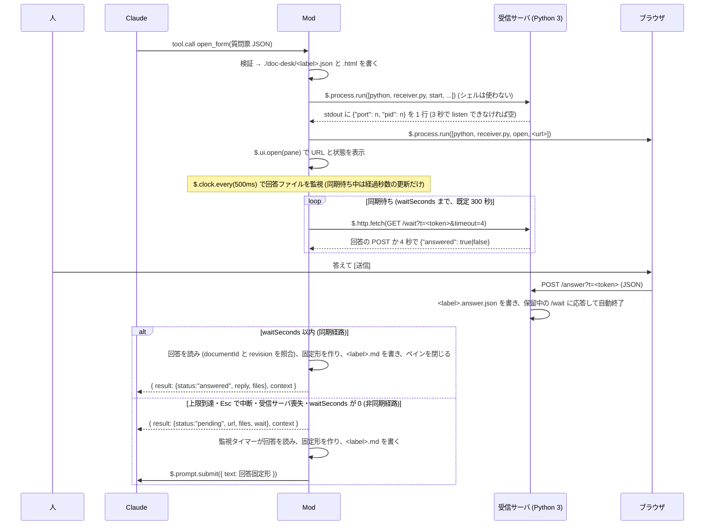

# doc-desk

使い方 (読み込み方、フォームの使い方、困ったとき) は [利用者ガイド](../../docs/doc-desk/usage.md) にあります。

doc-desk Mod (MVP)。Claude が文書を書く前に、文書の構成案と決定してほしい論点を
質問票 JSON としてツール `open_form` に渡すと、この Mod が自己完結の HTML シートを
`./doc-desk/` に書き、Python 3 の受信サーバをローカルに立ててブラウザで開きます。
人がブラウザで答えて [送信] を押すと、受信サーバが回答 JSON をファイルに書いて終了し、
Mod がそれを回答固定形 (`【doc-desk 回答】` で始まる文) にして Claude に届けます。

届け方は 2 経路です。`open_form` はツール呼び出しの中で `waitSeconds` (既定 300 秒) まで回答を待ち、
届けば固定形を Tool result (`status: "answered"`, `reply`) で返します (同期経路)。
上限に達した、人が Esc で中断した、受信サーバに届かなくなった、`waitSeconds: 0` のときは
`status: "pending"` を返してターンを終えてもらい、以後は `clock.every` の監視が回答を検知して
`$.prompt.submit` で user turn として届けます (非同期経路)。

指摘モード: Claude が書き上げた文書を HTML にして `doc-desk/<label>.doc.html` に書き出し、
ツール `open_review` を呼ぶと、この Mod がそのファイルを検査して指摘の画面を出します。
人は段落や文字列にチップ (短くする、根拠が要る、ここは良い など 9 種) とコメントで指摘を付け、段落をその場で書き換え、消し、足し、動かせます (添削)。
受信サーバ、同期待ち、監視、ペインは `open_form` と同じで、指摘は同じ `【doc-desk 回答】` の固定形の
`## 指摘` と `## 書き換え` の節で届きます。

背景と決定の記録は [docs/doc-desk/plan.md](../../docs/doc-desk/plan.md) にあります。
対象は Claude Code 2.1.278 の Claude Mods (function hooks、早期アクセス) です。

## 流れ



同期経路があるのは、人が数分で答えるふつうの場合に、Claude のターンを切らずに回答を渡すためです。
`pending` だけだと Claude のターンが一度終わり、回答は別の user turn として届きます。

## ファイル

| パス | 役割 |
| --- | --- |
| `hooks/register.ts` | フックの登録と状態機械 (idle → waiting → submitting → idle) |
| `hooks/host/index.ts` | `session.start` で `$` を束ねた関数群の型 |
| `hooks/store/pending-record.ts` | `$.store` に残す待機の記録の型、読み取り、古さの判定 (7 日) |
| `hooks/names.ts` | plugin 名、ツール名、コマンド名、ペイン id、見出し語 |
| `hooks/form/form-v1.ts` | 質問票 JSON スキーマ v1 と回答 JSON の型 |
| `hooks/form/validate.ts` | 質問票の検証 (エラーを全部返す) |
| `hooks/form/outline.ts` | 構成案の HTML で使える要素と属性 (検証と画面で共有)、構成案の検査 (使えない要素、印の過不足) |
| `hooks/form/answer.ts` | 回答 JSON の読み取り (`documentId` と `revision` が質問票と違えば無視) |
| `hooks/form/schema.ts` | `$.tool.register` に渡す JSON Schema |
| `hooks/sheet/render-html.ts` | 質問票 → 自己完結 HTML (素の JS を文字列で埋める)。左に構成案、右に選んだものの詳細 (全体の進み具合と次に見る項目 / 決定 / 表の説明)、下に進捗と送信。構成案の HTML はブラウザで DOMParser にかけ、許可した要素と属性だけで組み直す |
| `hooks/sheet/common.ts` | 2 つの画面が共有する CSS と、HTML と JSON の逃がし |
| `hooks/sheet/render-review.ts` | 指摘の画面 → 自己完結 HTML。左に文書 (DOMParser で解析し、許可した要素と属性だけで組み直す)、段落に上から番号を振る。右に全体 (指摘と書き換えの数と一覧、全体へのコメント) か、選んだ段落の操作 (チップ、コメント、この段落の指摘、書き換え・削除・移動・追加)。書き換えた段落は左に書き換えた後の文を出す |
| `hooks/reply/format.ts` | 回答 JSON + 質問票 → 回答固定形 v1 |
| `hooks/reply/summary.ts` | 回答固定形 → 畳んだ 1 行の中身 (選んだ案と補足の数、指摘と書き換えの数) |
| `hooks/review/review-v1.ts` | 指摘の画面 (`review`) と指摘の回答 JSON の型 (指摘と添削)、チップ 9 種 |
| `hooks/review/validate-review.ts` | `review` の検証 (エラーを全部返す) |
| `hooks/review/document.ts` | 文書の HTML の検査 (構成案と同じ要素、属性は表の colspan と rowspan だけ、10 万文字まで、段落が 1 つ以上) と、段落番号を振る要素 |
| `hooks/review/answer.ts` | 指摘の回答 JSON の読み取り (`kind`、`documentId`、`revision` が違えば無視、形の違う指摘と添削は捨てる) |
| `hooks/review/format.ts` | 指摘の回答 JSON → 回答固定形 (`## 指摘`、`## 指摘した段落`、`## 書き換え`) |
| `hooks/receiver/index.ts` | Python 3 の候補 (`python3`、`python`、`py -3`)、`receiver.py` のサブコマンドの argv (`start`、`clean`、`open`、`stop`)、`start` が印字する 1 行の読み取り、URL (`/`, `/wait`, `Link` 用の localhost) |
| `hooks/wait/sync-wait.ts` | 同期待ち: `tool.call` の中で `/wait` のロングポーリングを繰り返し、回答ファイルを読む (読み方は画面ごとに渡す) |
| `hooks/views/pane-view.ts` | 待機中のペイン (Box / Text / Button / Link) |
| `hooks/views/reply-row.ts` | 畳んだ回答行 (Box / Text。terminal と desktop で同じ木) |
| `hooks/views/strings.ts` | 固定文言 |
| `hooks/tool-input.d.ts` | `McpToolInputs` にツールの入力を足す宣言 (型付けのみ) |
| `scripts/receiver.py` | ローカル受信サーバ (Python 3 の標準ライブラリのみ、127.0.0.1、`/wait` のロングポーリング付き) と、OS ごとに違う操作のサブコマンド (`start` で切り離して起動、`open` でブラウザ、`clean` で削除、`stop` で停止) |
| `skills/doc-desk/` | Claude 側の手順 (SKILL.md) と references (下の「スキル」) |
| `tests/` | `claude plugin test` のテストと fixtures |

## What it hooks

`CLAUDE_CODE_ENABLE_FUNCTION_HOOKS=1 claude plugin validate plugins/doc-desk` の印字:

```
❯ ./register.ts hooks: session.start, tool.call{tool=mcp__doc-desk__open_form}, tool.call{tool=mcp__doc-desk__open_review}, command.run{command=doc-desk}, ui.render{component=Pane}, ui.render{component=UserMessage, props.origin has }, turn.complete, session.end, ui.close{id=doc-desk}
```

| event | what the hook does |
| --- | --- |
| `session.start` | `$` を host に束ね、ツール `open_form` と `open_review` と `/doc-desk` を登録し、Python 3 を `python3`、`python`、`py -3` の順に 1 回だけ探して結果を保持する。`e.cwd` を証跡の置き場の基準にする。続けて `$.store` の `pending:<cwd>` に前のセッションの待機の記録があれば引き継ぐ (下の「引き継ぎ」) |
| `tool.call` of `mcp__doc-desk__open_form` | 質問票を検証し (不正なら `{ status: "invalid", errors }`)、`doc-desk/<label>.json` と `.html` を書き、同じ label の前回の `.answer.json` を `receiver.py clean` で消し、受信サーバを `receiver.py start` で切り離して起動して stdout の 1 行から port と pid を読み、ブラウザを開き (`openBrowser: false` なら開かない)、ペインを開き、`clock.every(500)` で回答ファイルの監視を始める。続けて `waitSeconds` (既定 300、0 で待たない、上限 1800) まで `GET /wait?timeout=4` のロングポーリングで回答を待ち、届けば `{ status: "answered", reply, files }` と context 1 件を返す (user turn は投入しない)。上限到達・中断 (`next.signal`)・受信サーバ喪失・`waitSeconds: 0` なら `{ status: "pending", url, files, wait: { seconds, endedBy } }` と context 1 件を返し、以後は監視が届ける。待っている間に [取り消す] が押されれば `{ status: "cancelled", reason }`。受信サーバが起動できなければ `{ status: "failed", reason, files }` |
| `tool.call` of `mcp__doc-desk__open_review` | `review` を検証し、`doc-desk/<label>.doc.html` を読んで検査する (無い、読めない、許可リストに無い要素や属性、10 万文字超、段落なし、のどれかなら `{ status: "invalid", errors }`)。`doc-desk/<label>.json` に `review` を、`.html` に指摘の画面を書き、あとは `open_form` と同じ (受信サーバ、同期待ち、監視、ペイン)。結果の `files` は `{ doc, review, html }` (`answered` では `answer` と `md` を足す) |
| `command.run` of `doc-desk` | 起動時に見つけた回答が未送なら、`$.clock.after(0)` で回答固定形を `$.prompt.submit` する (`command.run` の中の `prompt.submit` はエンジンが拒むため)。そうでなく待機中ならペインを focus 付きで開き直し、ブラウザも開き直す。どちらでもなければ「待機中の質問票も指摘の画面もありません」 |
| `ui.render` of `Pane` (requestId `doc-desk`) | 見出し (`インタビュー: <label>  (rev n)`、指摘の画面では `指摘: <label>  (rev n)`)、URL (127.0.0.1 の文字)、`Link` (href は `http://localhost:<port>/?t=…`。`Link` の href は `https:` か `http://localhost` しか通らない)、経過秒数、[ブラウザで開く (o)] と [取り消す] を描く |
| `ui.render` of `UserMessage` (`props.origin.kind` が `plugin`) | この Mod (`origin.name` が `doc-desk`) が投入した `【doc-desk 回答】` の行を 1 行に畳む。質問票は `【doc-desk 回答】<documentId>  Q1=A  Q2=お任せ  補足 n 件`、指摘の画面は `指摘 n 件  書き換え m 件`。2 行目に保存した `.md` のパス (このセッションで届けたものだけ) と「ctrl+o で全文」。`isExpanded` (ctrl+o) のとき、固定形として読めないとき、他の plugin や人の行は `next(e)`。描き換えは行の見え方だけで、モデルが読む文は変わらない |
| `turn.complete` | 待機中で、main の turn (`agentId` なし) が `reason: "answer"` で終わったとき、1 つの待機につき 1 回だけ `{ text: "回答先: <url>  (/doc-desk で開き直せます)" }` を返して答えの下に出す |
| `session.end` | このセッションが待機の記録を持っていれば、その `heartbeatAtMs` を 0 に戻して lease を手放す (次のセッションが 90 秒待たずに引き継げる)。`reason` が `clear` か `resume` のときはプロセスが続き監視も続くので、手放さない (手放すと、次の heartbeat までの間に同じフォルダの別のセッションが引き継ぎ、両方で回答を届けてしまう) |
| `ui.close` of `doc-desk` | 人が閉じても監視は続け、状態行に「/doc-desk で開き直せます」を出す |

監視タイマーは同期待ちの間 (`Pending.isSyncWaiting`) は回答を届けず、経過秒数の更新だけ行います。同期待ちを抜けたときにフラグを下ろすので、同じ回答が Tool result と user turn の両方で届くことはありません。

引き継ぎ: 待機を始めると `$.store` の `pending:<cwd>:<セッション id>` に `{ kind, label, documentId, revision, token, port, pid, startedAtMs, sessionId, heartbeatAtMs }` を書き、回答が届くか取り消すと消します。`$.store` は plugin ごとに 1 つで、プロジェクトをまたいで共有されるので cwd をキーに含めます (区切りを `/` にそろえ、末尾の `/` を外し、Windows では小文字にします)。同じフォルダで同時に動くセッションが互いの記録を上書きしないよう、キーはセッションごとに分けます。記録を持っているセッションは 30 秒ごとに `heartbeatAtMs` を進めます。

次の `session.start` では、`$.store.keys()` から同じフォルダの記録を探し、次の順に見ます。

| 状態 | すること |
| --- | --- |
| 別のセッションが今も持っている (持ち主の id が違い、heartbeat が 90 秒以内) | 引き継がず、消しもせず、`$.ui.log` で 1 回だけ伝える (両方に回答が届いたり、片方の取り消しで相手の受信サーバを止めたりしない)。持ち主がクラッシュして `session.end` が来なかったときに備え、lease が切れる頃にもう一度見る (持ち主が生きていれば lease が延びているので、また待つ) |
| 形が違う | 記録を消す |
| 残り (持ち主のいない記録) | 待機を始めたのが新しい順に試す。7 日より古いものと証跡の無いものは消して次を試す。最初に使えるものを、先にこのセッションのキーへ書いてから前のキーを消して移し (逆の順だと、その間に lease の切れた持ち主の heartbeat が書き直し、両方が記録を持ってしまう)、下の順に見る。それより古い記録は、差し替わったものとして消し、`$.ui.log` で伝える (後日また引き継がない) |
| `.answer.json` がある | 固定形を `.md` に書く。`e.surface` が null (`-p`、SDK) なら `$.prompt.submit` で届け、受け付けられてから記録を消す (その前にプロセスが終わっても次の起動でまた届ける)。人がいれば `$.ui.log` と `$.ui.toast` で知らせ、`$.prompt.suggest` で `/doc-desk` を候補に出し、記録は `/doc-desk` で送るまで残す (送れなければ未送に戻す) |
| 受信サーバが生きている (`GET /wait?timeout=0` が `{"answered":false}`) | 監視を再開する。ブラウザもペインも開かず、`$.ui.status` に「前回の質問票 <label> が未回答です」(指摘の画面なら「前回の指摘の画面 …」) を出す |
| 受信サーバに届かない | 同じ token と `--port <記録の port>` で `receiver.py start` を呼び、監視を再開する。同じ port を取れなかったら生死をもう一度見て、古い受信サーバが生きていれば (さっきの確認は一時的な失敗)、起動し直した方を止めて古い方を使う。古い方の pid は他のプロセスに使い回されているかもしれないので止めない。古い方も死んでいれば新しい URL を `$.ui.log` で伝える。`.html` が消えていれば書き直す |

このセッションが止まっている間に lease (90 秒) が切れ、別のセッションが記録を引き継いだときは、heartbeat で「自分のキーが消え、同じ token の記録が別のセッションのキーにある」ことに気付き、受信サーバは止めずに手を引きます (同期待ちの最中なら `cancelled` の理由は「別のセッションが引き継ぎました」)。自分のキーが消えていても引き継がれていなければ (書き込みの失敗など)、記録を書き直して待ち続けます。

`$.prompt.submit` は、他のフックに断られると reject せず `{ drop }` で resolve します。これも受け付けられなかったものとして扱い、記録を消さず、未送として `/doc-desk` で送り直せるようにします (監視が届けるときも同じ)。同じ label の画面を出し直したときは、起動時に見つけた同じ label の未送の回答を捨てます (回答ファイルが消えて古くなるため)。

回答 JSON は user turn の隠し context には添えません。Claude Code 2.1.278 では plugin 自身の `prompt.submit` フックがその plugin の `$.prompt.submit` を見ないため (実測、plan.md 4 章 V7)、回答 JSON は `doc-desk/<label>.answer.json` を読んで照合します。

## What it calls on `$`

validate の印字:

```
❯ ./register.ts calls: $.clock.after, $.clock.every, $.clock.now, $.command.register, $.fs.exists, $.fs.read, $.fs.write, $.http.fetch, $.process.run, $.prompt.submit, $.prompt.suggest, $.session.id, $.store.delete, $.store.get, $.store.keys, $.store.set, $.tool.register, $.ui.close, $.ui.invalidate, $.ui.log, $.ui.open, $.ui.resolve, $.ui.status, $.ui.toast
```

`clock.after` (`/doc-desk` の後に未送の回答を送る), `clock.every` (回答の監視と、待機の記録の heartbeat), `clock.now`,
`command.register`, `fs.exists`, `fs.read`, `fs.write`,
`http.fetch` (同期待ちの `GET /wait?t=…&timeout=4` と、引き継ぎの生死確認 `timeout=0`。127.0.0.1 の受信サーバへ),
`process.run` (`<python> --version`、`<python> receiver.py` の `clean` / `start` / `open` / `stop`。シェルは使わない),
`prompt.submit`, `prompt.suggest` (起動時に届いていた回答を送る `/doc-desk` を候補に出す),
`session.id` (待機の記録の持ち主), `store.get` / `store.set` / `store.delete` / `store.keys` (待機の記録 `pending:<cwd>:<セッション id>`),
`tool.register`, `ui.close`, `ui.invalidate`, `ui.log`, `ui.open`, `ui.resolve`, `ui.status`, `ui.toast` (引き継いだ回答の案内と、回答が届いたときの「回答を受け取りました: <label>」)。
`$.plugin.root` も読みます (呼び出しではないので印字されません)。`model` は使いません。

`$.process.run` は型定義で「CLI only」とされています。ここでの CLI は、ローカルで動く Claude Code のプロセスを指すと
読んでいます。Claude Code Desktop もローカルの Claude Code を動かすので、受信サーバの起動、ブラウザを開く、停止、削除は
Desktop でも動きました (2026-09-23 確認、`answered` まで通過。フォームは既定のブラウザで開く)。
Mod はシェルを使わず、`receiver.py` のサブコマンドだけを呼ぶので、Windows でも同じ argv で動きます
(`sh`、`nohup`、`rm`、`kill`、`xdg-open` は Windows のプロセスからは見つかりません)。
Desktop では `~/.claude/settings.json` の `env` に `CLAUDE_CODE_ENABLE_FUNCTION_HOOKS=1` と
`CLAUDE_CODE_PLUGIN_DIRS=<このフォルダの絶対パス>` を書いて読み込ませます。
Desktop ではペイン (`$.ui.open`) が描かれませんでした。`/doc-desk` で人が求めて開いても出ません (2026-09-23 確認。
原因は未確定)。ブラウザは自動で開き、URL は Tool result にも載るので、Desktop ではペインに頼らずに使えます。
待機中に止めると、モデルには「ツールの実行が拒否された」と見え、`pending` は届きません。受信サーバと監視は
残るので、後から送った回答は user turn として届きます。

同期待ちとフック予算: フックの予算は 1 ディスパッチ 10 秒ですが、`$` 呼び出しの待ち中は時計が止まります
(`$.clock` の待ちは例外で、予算に数えられます)。そのため同期待ちは `$.clock.sleep` のポーリングではなく、
`$.http.fetch` で受信サーバの `/wait` を 4 秒ずつ保留させて待ちます。4 秒なのは、Esc で `next.signal` が
abort したあとフックが動けるのが 5 秒 (`lingerMs`) だからです。経過秒数は時計を読まず、要求した
`timeout` の合計で数えます。

## ファイルの置き場

セッションの cwd の下の `doc-desk/` に、質問票と指摘の画面の `label` ごとに書きます。

| ファイル | 中身 |
| --- | --- |
| `doc-desk/<label>.json` | 質問票 (検証済み)。指摘の画面では `review` (検証済み) |
| `doc-desk/<label>.doc.html` | 指摘の画面に出す文書の HTML (Claude が書き、Mod は読むだけで消さない) |
| `doc-desk/<label>.html` | HTML シート (トークンは埋めない。ブラウザの JS が URL の `?t=` から読む) |
| `doc-desk/<label>.answer.json` | ブラウザが POST した回答 JSON (`open_form` は同じ label の前回のものを起動前に消す) |
| `doc-desk/<label>.md` | 回答固定形 (Claude に送ったものと同じ) |

## スキル

`skills/doc-desk/SKILL.md` が Claude 側の手順です。設計書・仕様書・企画書・記事を書く (更新する) 依頼で発動し、現物把握 → 構成案を書き、論点を 3±1 問に圧縮して構成案に印で置く → 質問文と構成案の自己検査 → 文脈ゼロの subagent への試問 → `open_form` → 回答の反映と文書の検査 → (宣言があれば) 文書を HTML にして `open_review` → 指摘の反映、の順に進めます。Mod は描画と回収だけを担います。

| ファイル | 中身 |
| --- | --- |
| `skills/doc-desk/SKILL.md` | 手順、禁則、`open_form` の結果 (`answered` / `pending` / `cancelled` / `invalid` / `failed`) ごとの動き、Mod が無いときの案内、証跡と完了報告 |
| `references/form-spec-v1.md` | 質問票 JSON の書き方 (`hooks/form/validate.ts` の全規則とエラー文、構成案の HTML の規則、完全な例) |
| `references/reply-format-v1.md` | 回答固定形 v1 の契約と読み方 (`hooks/reply/format.ts` のゴールデンと一致) |
| `references/question-lint.md` | ja-text-communication の規範番号順の自己検査表 |
| `references/document-lint.md` | 回答を反映して書く文書の検査表。ja-text-communication の規範と、stop-ai-slop-jp と humanizer-ja から選んだ AI 臭の検査 (S1〜S24)、採用しなかった規則と理由 |
| `references/preflight.md` | 試問の 5 問、質問票の Markdown の形、subagent のプロンプト雛形、打ち切り規則 |
| `references/review-mode.md` | 指摘モード。宣言の判定、文書の HTML の書き方、`open_review` の入力と結果、長い文書の分け方、指摘の回答 (`hooks/review/format.ts` と一致)、反映と完了報告 |

## Try it

```sh
CLAUDE_CODE_ENABLE_FUNCTION_HOOKS=1 claude --plugin-dir plugins/doc-desk
```

対話モードで次のように頼みます。

> plugins/doc-desk/tests/fixtures/spec-auth-01.form.json を読んで、その JSON を form にして open_form ツールを呼んでください。回答が届くまで待ってください。

ブラウザが開くので、選択肢を選んで [送信] を押します。5 分 (`waitSeconds` の既定) 以内なら
ツールの結果 (`status: "answered"`) として Claude に届き、そのまま文書の作成に進みます。
5 分を過ぎるか Esc で中断すると `status: "pending"` でターンが終わり、あとで [送信] を押したときに
`【doc-desk 回答】spec-auth-01` で始まる user turn が届きます。
ブラウザを閉じてしまったら `/doc-desk` で開き直せます。

指摘の画面は、次のように頼んで試せます。

> 次の HTML を doc-desk/spec-auth-01-review.doc.html に書き出して、review に schemaVersion 1、documentId spec-auth-01、revision 1、label spec-auth-01-review、title 「認証方式の仕様」を渡して open_review ツールを呼んでください: `<h2>認証方式</h2><p>認証は OIDC に統一します。</p>`

## テストと検証

```sh
CLAUDE_CODE_ENABLE_FUNCTION_HOOKS=1 claude plugin validate plugins/doc-desk
CLAUDE_CODE_ENABLE_FUNCTION_HOOKS=1 claude plugin test plugins/doc-desk
npx -y -p typescript tsc -p plugins/doc-desk --noEmit
```

`tsc` はリポジトリ直下の `.claude/types/` (`claude -p "/plugin-types"` が生成、git には入れない) を読みます。

Windows では、エンジンが `$.fs` に渡したパスを `C:\work\doc-desk\x.json` の形に直してフックへ渡します。
テストの偽装 (`tests/fixtures/world.ts`) は、パスを `/work/doc-desk/x.json` の形にそろえてから照合します。
`process.run` の argv は直されないので、そのまま照合します。

受信サーバ単体:

```sh
python3 plugins/doc-desk/scripts/receiver.py start --token t \
  --html doc-desk/spec-auth-01.html --out /tmp/x.answer.json   # 切り離して起動し {"port": n, "pid": n} を 1 行出す (serve なら前面で動かす)
curl "http://127.0.0.1:<port>/?t=t"                       # HTML (トークン無しは 403)
curl "http://127.0.0.1:<port>/wait?t=t&timeout=4"          # 回答の POST か 4 秒まで保留 → {"answered":true|false}
curl -X POST -d '{"answers":{}}' "http://127.0.0.1:<port>/answer?t=t"   # 書いて、保留中の /wait に応答してから終了
python3 plugins/doc-desk/scripts/receiver.py stop <pid>        # 止める (もう無ければ何もしない)
python3 plugins/doc-desk/scripts/receiver.py clean /tmp/x.answer.json   # 消す
```

Windows で `python3` が Microsoft Store の案内に当たるときは、`python` か `py -3` に読み替えます (Mod もこの順に探します)。

`<port>` と `<pid>` は `start` が出した 1 行の値です。`--port <n>` を足すとその port を使い、塞がっていれば OS に選ばせます。
Windows では `SO_REUSEADDR` を付けず `SO_EXCLUSIVEADDRUSE` で listen するので、使用中の port を横取りしません
(2026-09-24 確認: 使用中の port を指定すると別の port になり、TIME_WAIT だけ残る port は取り直せる)。

## 実機で確かめていないこと (2026-09-23 時点)

- Esc で中断したあと、保留中の `/wait` が戻ってから `pending` を返すまでが `lingerMs` (5 秒) に収まるか。
- ペインの `Link` (`http://localhost:<port>`) を押したとき、ブラウザが 127.0.0.1 の受信サーバに届くか (`::1` に解決されたときの切り替え。curl では届く)。
- `waitSeconds` の既定 300 秒の間、ツール呼び出しが進行中のままで、表示や他のフックに問題が出ないか。
- 引き継ぎ (2026-09-24 時点): `session.start` の中で出した `$.ui.toast` と `$.ui.log` が、terminal と Desktop で見えるか。`$.prompt.suggest` の `/doc-desk` が起動直後のプロンプト欄に薄い候補として出るか (エンジン自身の候補に上書きされないか)。テストキットでは通っています。
- 回答行の畳み (2026-09-24 時点): plugin の投入した user turn の行で `ui.render` の `UserMessage` が呼ばれ、畳んだ行が描かれるか。テストキットでは terminal と desktop の両方で通っています。
