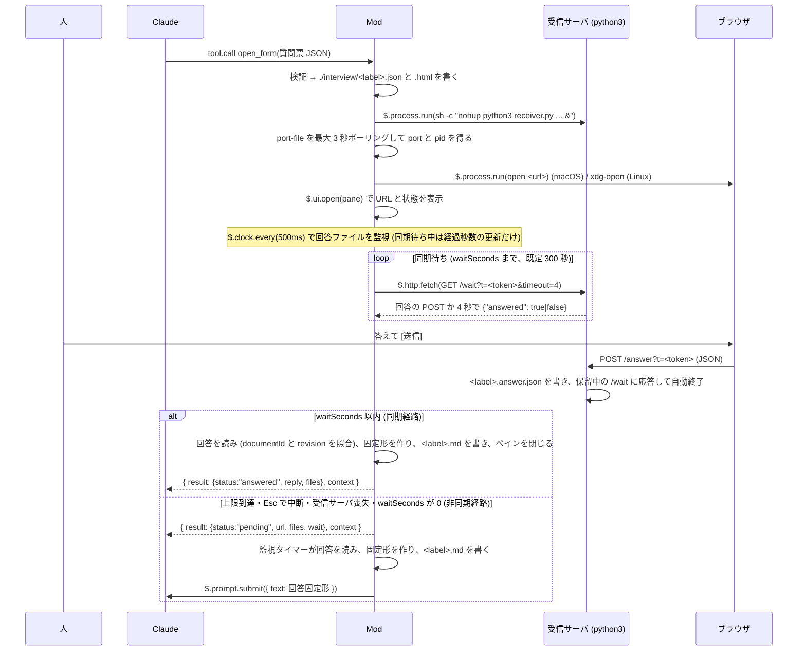

# document-interview

使い方 (読み込み方、フォームの答え方、困ったとき) は [利用者ガイド](../../docs/document-interview-mod/usage.md) にあります。

Document Interview Mod (MVP)。Claude が文書を書く前に、文書の構成案と決定してほしい論点を
質問票 JSON としてツール `open_form` に渡すと、この Mod が自己完結の HTML シートを
`./interview/` に書き、python3 の受信サーバをローカルに立ててブラウザで開きます。
人がブラウザで答えて [送信] を押すと、受信サーバが回答 JSON をファイルに書いて終了し、
Mod がそれを回答固定形 (`【インタビュー回答】` で始まる文) にして Claude に届けます。

届け方は 2 経路です。`open_form` はツール呼び出しの中で `waitSeconds` (既定 300 秒) まで回答を待ち、
届けば固定形を Tool result (`status: "answered"`, `reply`) で返します (同期経路)。
上限に達した、人が Esc で中断した、受信サーバに届かなくなった、`waitSeconds: 0` のときは
`status: "pending"` を返してターンを終えてもらい、以後は `clock.every` の監視が回答を検知して
`$.prompt.submit` で user turn として届けます (非同期経路)。

背景と決定の記録は [docs/document-interview-mod/plan.md](../../docs/document-interview-mod/plan.md) にあります。
対象は Claude Code 2.1.278 の Claude Mods (function hooks、早期アクセス) です。

## 流れ



同期経路があるのは、人が数分で答えるふつうの場合に、Claude のターンを切らずに回答を渡すためです。
`pending` だけだと Claude のターンが一度終わり、回答は別の user turn として届きます。

## ファイル

| パス | 役割 |
| --- | --- |
| `hooks/register.ts` | フックの登録と状態機械 (idle → waiting → submitting → idle) |
| `hooks/host/index.ts` | `session.start` で `$` を束ねた関数群の型 |
| `hooks/names.ts` | plugin 名、ツール名、コマンド名、ペイン id、見出し語 |
| `hooks/form/form-v1.ts` | 質問票 JSON スキーマ v1 と回答 JSON の型 |
| `hooks/form/validate.ts` | 質問票の検証 (エラーを全部返す) |
| `hooks/form/outline.ts` | 構成案の HTML で使える要素と属性 (検証と画面で共有)、構成案の検査 (使えない要素、印の過不足) |
| `hooks/form/answer.ts` | 回答 JSON の読み取り (`documentId` と `revision` が質問票と違えば無視) |
| `hooks/form/schema.ts` | `$.tool.register` に渡す JSON Schema |
| `hooks/sheet/render-html.ts` | 質問票 → 自己完結 HTML (素の JS を文字列で埋める)。左に構成案、右に選んだものの詳細 (全体の進み具合と次に見る項目 / 決定 / 表の説明)、下に進捗と送信。構成案の HTML はブラウザで DOMParser にかけ、許可した要素と属性だけで組み直す |
| `hooks/reply/format.ts` | 回答 JSON + 質問票 → 回答固定形 v1 |
| `hooks/receiver/index.ts` | 受信サーバの argv、前回の回答を消す argv、port-file の読み取り、URL (`/`, `/wait`, `Link` 用の localhost) |
| `hooks/wait/sync-wait.ts` | 同期待ち: `tool.call` の中で `/wait` のロングポーリングを繰り返し、回答ファイルを読む |
| `hooks/views/pane-view.ts` | 待機中のペイン (Box / Text / Button / Link) |
| `hooks/views/strings.ts` | 固定文言 |
| `hooks/tool-input.d.ts` | `McpToolInputs` にツールの入力を足す宣言 (型付けのみ) |
| `scripts/receiver.py` | ローカル受信サーバ (python3 標準ライブラリのみ、127.0.0.1、`/wait` のロングポーリング付き) |
| `skills/document-interview/` | Claude 側の手順 (SKILL.md) と references (下の「スキル」) |
| `tests/` | `claude plugin test` のテストと fixtures |

## What it hooks

`CLAUDE_CODE_ENABLE_FUNCTION_HOOKS=1 claude plugin validate plugins/document-interview` の印字:

```
❯ ./register.ts hooks: session.start, tool.call{tool=mcp__document-interview__open_form}, command.run{command=interview}, ui.render{component=Pane}, ui.close{id=interview}
```

| event | what the hook does |
| --- | --- |
| `session.start` | `$` を host に束ね、ツール `open_form` と `/interview` を登録し、`python3 --version` を 1 回確かめて結果を保持する。`e.cwd` を証跡の置き場の基準にする |
| `tool.call` of `mcp__document-interview__open_form` | 質問票を検証し (不正なら `{ status: "invalid", errors }`)、`interview/<label>.json` と `.html` を書き、同じ label の前回の `.answer.json` と `.port.json` を `rm -f` で消し、受信サーバを `nohup` で起動して port-file を最大 3 秒待ち、ブラウザを開き (`openBrowser: false` なら開かない)、ペインを開き、`clock.every(500)` で回答ファイルの監視を始める。続けて `waitSeconds` (既定 300、0 で待たない、上限 1800) まで `GET /wait?timeout=4` のロングポーリングで回答を待ち、届けば `{ status: "answered", reply, files }` と context 1 件を返す (user turn は投入しない)。上限到達・中断 (`next.signal`)・受信サーバ喪失・`waitSeconds: 0` なら `{ status: "pending", url, files, wait: { seconds, endedBy } }` と context 1 件を返し、以後は監視が届ける。待っている間に [取り消す] が押されれば `{ status: "cancelled", reason }`。受信サーバが起動できなければ `{ status: "failed", reason, files }` |
| `command.run` of `interview` | 待機中ならペインを focus 付きで開き直し、ブラウザも開き直す。待機中でなければ「待機中の質問票はありません」 |
| `ui.render` of `Pane` (requestId `interview`) | label と revision、URL (127.0.0.1 の文字)、`Link` (href は `http://localhost:<port>/?t=…`。`Link` の href は `https:` か `http://localhost` しか通らない)、経過秒数、[ブラウザで開く (o)] と [取り消す] を描く |
| `ui.close` of `interview` | 人が閉じても監視は続け、状態行に「/interview で開き直せます」を出す |

監視タイマーは同期待ちの間 (`Pending.isSyncWaiting`) は回答を届けず、経過秒数の更新だけ行います。同期待ちを抜けたときにフラグを下ろすので、同じ回答が Tool result と user turn の両方で届くことはありません。

回答 JSON は user turn の隠し context には添えません。Claude Code 2.1.278 では plugin 自身の `prompt.submit` フックがその plugin の `$.prompt.submit` を見ないため (実測、plan.md 4 章 V7)、回答 JSON は `interview/<label>.answer.json` を読んで照合します。

## What it calls on `$`

validate の印字:

```
❯ ./register.ts calls: $.clock.after, $.clock.every, $.clock.now, $.command.register, $.fs.exists, $.fs.read, $.fs.write, $.http.fetch, $.process.run, $.prompt.submit, $.tool.register, $.ui.close, $.ui.invalidate, $.ui.log, $.ui.open, $.ui.resolve, $.ui.status
```

`clock.after` (port-file の待ち), `clock.every` (回答の監視), `clock.now`,
`command.register`, `fs.exists`, `fs.read`, `fs.write`,
`http.fetch` (同期待ちの `GET /wait?t=…&timeout=4`。127.0.0.1 の受信サーバへ),
`process.run` (`python3 --version`、`rm -f`、`nohup python3 receiver.py ...`、`open` / `xdg-open`、`kill`),
`prompt.submit`, `tool.register`, `ui.close`, `ui.invalidate`, `ui.log`, `ui.open`, `ui.resolve`, `ui.status`。
`$.plugin.root` も読みます (呼び出しではないので印字されません)。`model`, `store` は使いません。

`$.process.run` は型定義で「CLI only」とされています。ここでの CLI は、ローカルで動く Claude Code のプロセスを指すと
読んでいます。Claude Code Desktop もローカルの Claude Code を動かすので、受信サーバの起動、ブラウザを開く、`kill`、`rm` は
Desktop でも動きました (2026-09-23 確認、`answered` まで通過。フォームは既定のブラウザで開く)。
Desktop では `~/.claude/settings.json` の `env` に `CLAUDE_CODE_ENABLE_FUNCTION_HOOKS=1` と
`CLAUDE_CODE_PLUGIN_DIRS=<このフォルダの絶対パス>` を書いて読み込ませます。
Desktop ではペイン (`$.ui.open`) が描かれませんでした。`/interview` で人が求めて開いても出ません (2026-09-23 確認。
原因は未確定)。ブラウザは自動で開き、URL は Tool result にも載るので、Desktop ではペインに頼らずに使えます。
待機中に止めると、モデルには「ツールの実行が拒否された」と見え、`pending` は届きません。受信サーバと監視は
残るので、後から送った回答は user turn として届きます。

同期待ちとフック予算: フックの予算は 1 ディスパッチ 10 秒ですが、`$` 呼び出しの待ち中は時計が止まります
(`$.clock` の待ちは例外で、予算に数えられます)。そのため同期待ちは `$.clock.sleep` のポーリングではなく、
`$.http.fetch` で受信サーバの `/wait` を 4 秒ずつ保留させて待ちます。4 秒なのは、Esc で `next.signal` が
abort したあとフックが動けるのが 5 秒 (`lingerMs`) だからです。経過秒数は時計を読まず、要求した
`timeout` の合計で数えます。

## ファイルの置き場

セッションの cwd の下の `interview/` に、質問票の `label` ごとに書きます。

| ファイル | 中身 |
| --- | --- |
| `interview/<label>.json` | 質問票 (検証済み) |
| `interview/<label>.html` | HTML シート (トークンは埋めない。ブラウザの JS が URL の `?t=` から読む) |
| `interview/<label>.port.json` | 受信サーバが書く `{"port": n, "pid": n}` |
| `interview/<label>.answer.json` | ブラウザが POST した回答 JSON (`open_form` は同じ label の前回のものを起動前に消す) |
| `interview/<label>.md` | 回答固定形 (Claude に送ったものと同じ) |

## スキル

`skills/document-interview/SKILL.md` が Claude 側の手順です。設計書・仕様書・企画書・記事を書く (更新する) 依頼で発動し、現物把握 → 構成案を書き、論点を 3±1 問に圧縮して構成案に印で置く → 質問文と構成案の自己検査 → 文脈ゼロの subagent への試問 → `open_form` → 回答の反映と文書の検査、の順に進めます。Mod は描画と回収だけを担います。

| ファイル | 中身 |
| --- | --- |
| `skills/document-interview/SKILL.md` | 手順、禁則、`open_form` の結果 (`answered` / `pending` / `cancelled` / `invalid` / `failed`) ごとの動き、Mod が無いときの案内、証跡と完了報告 |
| `references/form-spec-v1.md` | 質問票 JSON の書き方 (`hooks/form/validate.ts` の全規則とエラー文、構成案の HTML の規則、完全な例) |
| `references/reply-format-v1.md` | 回答固定形 v1 の契約と読み方 (`hooks/reply/format.ts` のゴールデンと一致) |
| `references/question-lint.md` | ja-text-communication の規範番号順の自己検査表 |
| `references/document-lint.md` | 回答を反映して書く文書の検査表。ja-text-communication の規範と、stop-ai-slop-jp と humanizer-ja から選んだ AI 臭の検査 (S1〜S24)、採用しなかった規則と理由 |
| `references/preflight.md` | 試問の 5 問、質問票の Markdown の形、subagent のプロンプト雛形、打ち切り規則 |

## Try it

```sh
CLAUDE_CODE_ENABLE_FUNCTION_HOOKS=1 claude --plugin-dir plugins/document-interview
```

対話モードで次のように頼みます。

> plugins/document-interview/tests/fixtures/spec-auth-01.form.json を読んで、その JSON を form にして open_form ツールを呼んでください。回答が届くまで待ってください。

ブラウザが開くので、選択肢を選んで [送信] を押します。5 分 (`waitSeconds` の既定) 以内なら
ツールの結果 (`status: "answered"`) として Claude に届き、そのまま文書の作成に進みます。
5 分を過ぎるか Esc で中断すると `status: "pending"` でターンが終わり、あとで [送信] を押したときに
`【インタビュー回答】spec-auth-01` で始まる user turn が届きます。
ブラウザを閉じてしまったら `/interview` で開き直せます。

## テストと検証

```sh
CLAUDE_CODE_ENABLE_FUNCTION_HOOKS=1 claude plugin validate plugins/document-interview
CLAUDE_CODE_ENABLE_FUNCTION_HOOKS=1 claude plugin test plugins/document-interview
npx -y -p typescript tsc -p plugins/document-interview --noEmit
```

`tsc` はリポジトリ直下の `.claude/types/` (`claude -p "/plugin-types"` が生成、git には入れない) を読みます。

受信サーバ単体:

```sh
python3 plugins/document-interview/scripts/receiver.py --port-file /tmp/x.port.json --token t \
  --html interview/spec-auth-01.html --out /tmp/x.answer.json
curl "http://127.0.0.1:<port>/?t=t"                       # HTML (トークン無しは 403)
curl "http://127.0.0.1:<port>/wait?t=t&timeout=4"          # 回答の POST か 4 秒まで保留 → {"answered":true|false}
curl -X POST -d '{"answers":{}}' "http://127.0.0.1:<port>/answer?t=t"   # 書いて、保留中の /wait に応答してから終了
```

`<port>` は `/tmp/x.port.json` の `port` です。

## 実機で確かめていないこと (2026-09-23 時点)

- Esc で中断したあと、保留中の `/wait` が戻ってから `pending` を返すまでが `lingerMs` (5 秒) に収まるか。
- ペインの `Link` (`http://localhost:<port>`) を押したとき、ブラウザが 127.0.0.1 の受信サーバに届くか (`::1` に解決されたときの切り替え。curl では届く)。
- `waitSeconds` の既定 300 秒の間、ツール呼び出しが進行中のままで、表示や他のフックに問題が出ないか。
